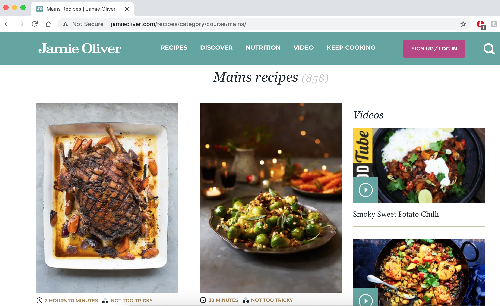
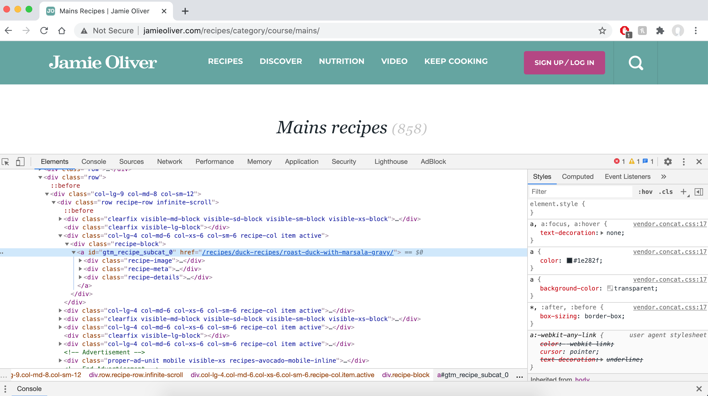

**The journey to my first ‘full-stack’ data science project — a practical guide to web scraping**

I’ve had my fun playing around with all the ‘classic’ ML datasets (the likes of MNIST, Titanic, Iris, etc.) and I decided it's time to start something of my own. The main reason being that I simply want something different. It all felt somewhat artificial, I want something new and challenging. Something that is not served to me on a silver platter.

I spend a good while mulling over possible projects and came up with a few possible avenues, one of which I will go over in this post. To help get more out of the experience, I thought I would blog my journey.

<!--truncate-->

As a student, I often fall into the trap of cooking the same recipes over and over again. On one hand, it’s pretty great, I know what I am eating and I know that what I am putting in my meals works for me. But oh boy is it boring (as I'm writing this I'm tucking into my 3rd portion of bolognese in four days…).

So… the idea: Given a list of ingredients, what are different recipes I can make? That is, what recipes can I make with the food I have in my apartment?

I hope to build a recommendation system in which the ingredients available by the user is taken as input, and the appropriate dishes or recipes are recommended to the user by Machine Learning (most likely) using the K-Nearest Neighbors algorithm. I hope to then use Flask to deploy the model so that the output can be visualized in a convenient and user-friendly way.

This project idea appeals to me in a few ways:

- I can find and [scrape](https://en.wikipedia.org/wiki/Web_scraping) the data myself

- Hopefully, by the end of it, I will have a product that I’ll actually use

- It’s open-ended, e.g. can I take a picture of the ingredients in my fridge as opposed to inputting ingredients manually?

I have had a lot of practice in the machine learning aspect of data science but that isn't all there is. I want to practice using a diverse set of tools to solve a wide range of problems, and web scraping is definitely something I need to brush up on. So, this blog is dedicated to just that.

First things first, I need a data source. I frequently use Jamie Oliver’s [cooking website](https://www.jamieoliver.com/) and I really enjoy a lot of the recipes on there so this was a fairly obvious source of data for me. The other benefits are that is popular to the general public and it well maintained/monitored.

The complete code for scraping the recipe data from Jamie Oliver’s website can be found on my [GitHub](https://github.com/jackmleitch/Whatscooking-). Side note: I prefer to not use Jupyter Notebooks for anything other than [EDA](https://en.wikipedia.org/wiki/Exploratory_data_analysis). Maybe I will do another blog post about this in the future but in the meantime, some food for thought on the topic can be found [here](https://towardsdatascience.com/the-case-against-the-jupyter-notebook-d4da17e97243).

## Let's get some data!

So what libraries do we need? The most common for web scraping include `requests`, Beautiful Soup (`bs4`), and `Selenium`. In this case, we will be using requests and Beautiful Soup. Although Selenium is very adequate, it’s just not needed in this here. We are pulling content from static HTML pages and you would use Selenium when crawling content that is added to the page via JavaScript. Using Selenium here is just going to slow us down.

Before we get going we should do a little bit of exploring.




The ‘[main recipes](https://www.jamieoliver.com/recipes/category/course/mains/)’ section of the website contains 858 different recipes, perfect -we now know where to look. We can break this task up into two steps.

- Step 1: obtain URLs to each recipe page

- Step 2: Within each of these URLs, find recipe attributes: recipe name, ingredients, serving size, cooking time, and difficulty.

## Set up

We want to import requests, BeautifulSoup, pandas and time (I will get to time later.

```py
import pandas as pd
from bs4 import BeautifulSoup
import requests
import time
```

We then want to specify the URL we want to scrape. It is worth noting that all the recipe links are on the same webpage, so we solely want to scrape URL links from https://www.jamieoliver.com/recipes/category/course/mains/. That is, we don't need to add `/page1`, `/page2` etc.

```py
# Define the url in python
url = “https://www.jamieoliver.com/recipes/category/course/mains/"
```

## Step 1

Now we use requests to retrieve content from the URL and BeautifulSoup to extract the required information from our requested content. Our target website is written in HTML so we need to use the `html.parser`.

```py
# Fetching html from the website
page = requests.get(url)
# BeautifulSoup enables to find the elements/tags in a webpage
soup = BeautifulSoup(page.text, “html.parser”)
```

So, what are we working with? Let's print the soup variable…

```py
print(soup)
...
<div class=”recipe-block”>
<a href=”/recipes/fish-recipes/chargrilled-tuna-with-oregano-oil-and-beautifully-dressed-peas-and-broad-beans/” id=”gtm_recipe_subcat_816">
<div class=”recipe-image”>
0) &                    (recipe_urls.str.contains(“/recipes/”)==True) &        (recipe_urls.str.contains(“-recipes/”)==True) & (recipe_urls.str.contains(“course”)==False) & (recipe_urls.str.contains(“books”)==False) & (recipe_urls.str.endswith(“recipes/”)==False)].unique()
```

This piece of code makes convenient use of list comprehensions, then we filter the URLs a little bit e.g. all of the recipes contain at least 1 ‘-’ so we only take hrefs with `count(“-”)>0`.

The hrefs we have obtained are only the trail end of each URL so we finally just need to add in the start of the full URL to all these items.

```py
df[‘recipe_urls’] = “https://www.jamieoliver.com" + df[‘recipe_urls’].astype(‘str’)
```

## Step 2

We now have 858 URLs to the different recipe pages, so let's just pick one and figure what data we want to collect from each page. From there we then generalize and automate the process. I’m a big pasta guy so let's look at some [Beautiful courgette carbonara](https://www.jamieoliver.com/recipes/pasta-recipes/beautiful-courgette-penne-carbonara/). I want to extract the recipe title, ingredients, number of people it serves, cooking time, and difficulty. I’m conscious of repeating myself so I will just walk through getting the recipe title and ingredients (the most faffy one). As per usual, the inspecting element tool is our friend. If we inspect the title on the page we find the HTML:

`<h1 class=”hidden-xs”>Beautiful courgette carbonara</h1>`

`<h1>` tags are used to define HTML headings. Therefore, to get the main webpage title we can just do the following:

```py
url = 'https://www.jamieoliver.com/recipes/pasta-recipes/beautiful-courgette-penne-carbonara/'
soup = BeautifulSoup(requests.get(url).content, 'html.parser')
print(soup.find(‘h1’).text.strip())
# Beautiful courgette carbonara
```

The find method allows us to just obtain the first `<h1>` tag rather than all of them (`find_all`). I then used `.strip()` to remove all the leading and trailing spaces from the string.

Right, so what do we need to make our pasta? By inspecting we find the ingredients are in list tags `<li>`:

```html
<ul class="”ingred-list" “>
  <li>6 medium green and yellow courgettes</li>
  <li>500 g penne</li>
  <li>4 large free-range eggs</li>
  <li>100 ml single cream</li>
  ...
</ul>
```

We can loop over all the elements in the list and append them to an ingredients list. There is a lot of empty space in each list element so we can split up each ingredient into single words (using `.split()`) and then join the string back up again (using `' '.join()`). A simple but elegant solution.

```py
ingredients = []
for li in soup.select(‘.ingred-list li’):
    ingred = ‘ ‘.join(li.text.split())
    ingredients.append(ingred)
print(ingredients)
# ['6 medium green and yellow courgettes', '500 g penne', '4 large free-range eggs', '100 ml single cream', '1 small handful of Parmesan cheese', 'olive oil', '6 slices of higher-welfare back bacon', '½ a bunch of fresh thyme , (15g)', 'a few courgette flowers , (optional)']
```

Excellent. I then created a class that I could call on to extract all the information from each URL. I mentioned earlier that there might be URLs that are not recipes so we can use a `try` `except` condition in case the information is not found (e.g. the [videos](https://www.jamieoliver.com/videos/) page does not contain an ingredient list). I just added in Na values here, which will make it very easy to remove these URLs later. Again, the full scripts can be found on my [Github](https://github.com/jackmleitch/Whatscooking-).

```py title="/src/web_scrape_jamie_oliver.py"
import numpy as np
class JamieOliver():
  def __init__(self, url):
     self.url = url
     self.soup = BeautifulSoup(requests.get(url,    headers=headers).content, 'html.parser')
  def ingredients(self):
“”” Creating a list containing the ingredients of the recipe “””
      try:
         ingredients = []
         for li in self.soup.select(‘.ingred-list li’):
             ingred = ‘ ‘.join(li.text.split())
             ingredients.append(ingred)
         return ingredients
      except:
         return np.nan
...
```

## All together now

All that's left for us to do now is to loop over each URL in our data frame (`recipe_df`). A word of caution though: we don't want to overload the website by making a tonne of requests in a short period of time (we also don't want to get blocked…), this is where the `time.sleep` method comes in. It simply suspends a program for a given number of seconds. Using NumPy's `random.randint()` method we can pause our program by a random number of seconds, `random.randint(5,10,1)` pauses it anytime between 5 and 10 seconds for example.

If you want you can also identify yourself to the website by using a header in the following way.

```py
headers = {'user-agent' : 'Mozilla/5.0 (Macintosh; Intel Mac OS X 10_9_5); Jack Leitch'}
page = requests.get(url, headers=headers)
```

The following code finishes off the scrape and writes the data frame created to a CSV file:

```py title="/src/scrape_data.py"
attribs = [‘recipe_name’, ‘serves’, ‘cooking_time’, ‘difficulty’, ‘ingredients’]
# For each url (i) we add the attribute data to the i-th row
JamieOliver_df = pd.DataFrame(columns=attribs)
for i in range(0,len(recipe_df[‘recipe_urls’])):
    url = recipe_df[‘recipe_urls’][i]
    recipe_scraper = JamieOliver(url)
    temp.loc[i] = [getattr(recipe_scraper, attrib)() for attrib in attribs]
    if i % 25 == 0:
       print(f’Step {i} completed’)
    time.sleep(np.random.randint(1,5,1))
# Put all the data into the same dataframe
JamieOliver_df[‘recipe_urls’] = recipe_df[‘recipe_urls’]
# Re-organise columns
columns = [‘recipe_urls’] + attribs
JamieOliver_df = JamieOliver_df[columns]
# Save dataframe to a csv file
JamieOliver_df.to_csv(r"/Users/Jack/Documents/ML/Projects/Whatscooking/input/JamieOliver_full.csv", index=False)
```

## Summary

We started by connecting to the webpage, we then parsed the HTML using BeautifulSoup, then for each recipe webpage we looped through the soup object to extract the relevant information.

This is my first ever blog post so any feedback would be much appreciated and please give this a clap or comment if you enjoyed it/found it useful.

I hope to continue with these blogs as I progress further with my first end to end data science project. In the next post, I will be preprocessing my data (using nltk) and doing some data visualization. Thanks for reading!
