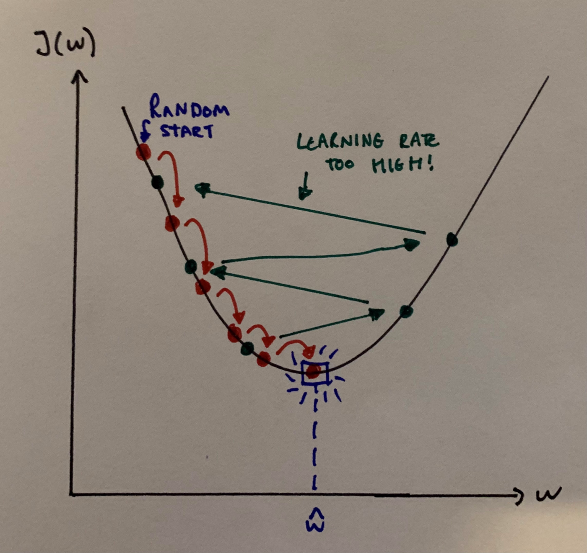
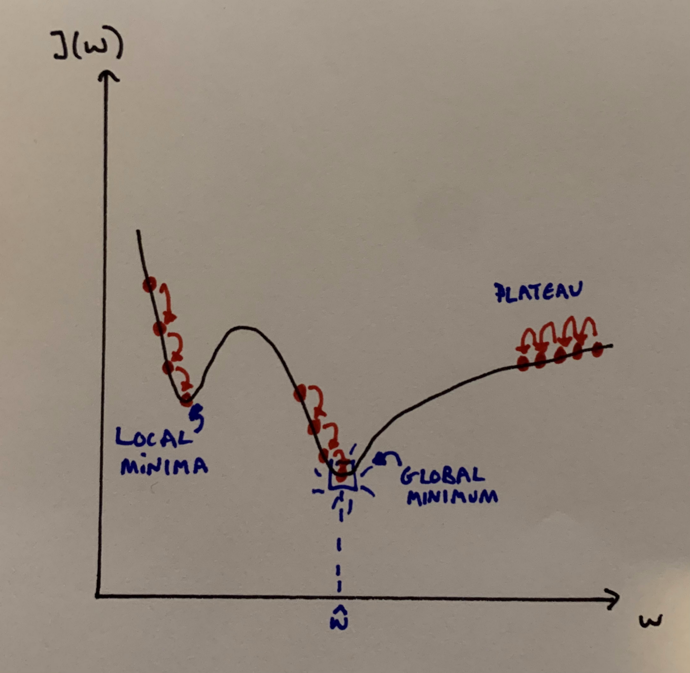
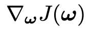
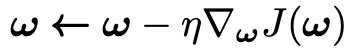
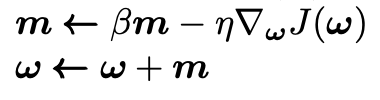
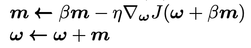
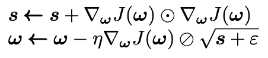
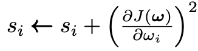
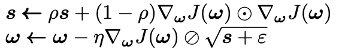
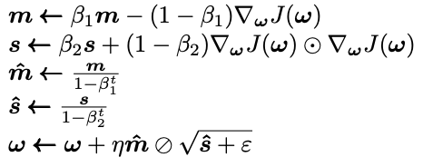

**Optimizing your choice of optimizer**

**Gradient descent** is an optimization algorithm used to minimize some cost function by iteratively moving in the direction of **steepest descent**. That is, moving in the direction which has the most negative gradient. In machine learning, we use gradient descent to continually tweak the parameters in our model in order to minimize a cost function. We start with some set of values for our model parameters (weights and biases in a neural network) and improve them slowly. In this blog post, we will start by exploring some basic optimizers commonly used in classical machine learning and then move on to some of the more popular algorithms used in Neural Networks and Deep Learning.

<!--truncate-->

Imagine you're out for a run (or walk, whatever floats your boat) in the mountains and suddenly a thick mist comes in impairing your vision. A good strategy to get down the mountain is to feel the ground in every direction and take a step in the direction in which the ground is descending the fastest. Repeating this you should end up at the bottom of the mountain (although you might also end up at something that looks like the bottom that isn't — more on this later). This is exactly what gradient descent does: it measures the local gradient of the cost function **J(ω)** (parametrized by model parameters ω), and moves in the direction of descending gradient. Once we reach a gradient of zero, we have reached our minimum.

Suppose now that the steepness of the hill isn't immediately obvious to you (maybe you're too cold to feel your feet, use your imagination!), so you have to use your phone's accelerometer to measure the gradient. It's also really cold out so to check your phone you have to stop running and take your gloves off. Therefore, you need to minimize the use of your phone if you hope to make it down anytime soon! So you need to choose the right frequency at which you should measure the steepness of the hill so as not to go off track and at the same time reach home before the sunset. This amount of time between checks is what is known as the **learning rate** i.e. the size of steps we take downhill. If our learning rate is too small, then the algorithm will take a long time to converge. But, if our learning rate is too high the algorithm can diverge and just past the minimum.



An important point to note is that not all cost functions are convex (the MSE cost function for Linear Regression is convex, however). A function is convex if the line segment between any two points on the graph of the function lies above the graph between the two points. Convexity is nice as it implies that there is a single global minimum. Problems start to occur when the cost functions aren’t convex: there may be ridges, plateaus, holes, etc. This makes convergence to the minimum difficult. Fortunately, there are techniques available to us to help combat some of these issues.



## Batch Gradient Descent

The vanilla of the gradient descent world. In batch gradient descent we use the full training set X at each gradient step. Because of this, when using large training sets it can be agonizingly slow.
We start by finding the gradient vector of the cost function, we denote this by



Here, **J(ω)** is the cost function parametrized by the model parameters **ω**) and **∇** denotes the vector differential operator. Now we have the gradient vector, we just need it to go in the opposite direction (downhill). Then, multiplying by the learning rate **η** we get our one-step gradient descent update equation:



Implementation of batch gradient descent in python couldn't be simpler!

```py title="/src/batch_gradient_descent.py"
import numpy as np
eta = 0.01 # our chosen learning rate
iterations = 10^3
n = 100
theta = np.random.randn(d,1) # random initialization, with d being
# the dimension of theta
for i in range(iterations):
    gradients = 2/n * X.T.dot(X.dot(theta) - y)
    theta = theta - eta * gradients
```

We can use a grid search to find a good learning rate if we so desire. To find the correct number of iterations it normally suffices to set the number of iterations to a very large number but then interrupt the algorithm when the gradient vector (gradients) becomes smaller than some pre-set tolerance (normally denoted **ϵ**). This works because when the gradient vector becomes tiny, we are extremely close to our minimum.

One other important note is that when using Gradient Descent you should ensure that all of your features have a similar scale as otherwise, it will take much longer for the algorithm to converge — Sckikit-Learn’s StandardScaler usually does the trick. What can we do to speed up our optimizer though? Enter Stochastic Gradient Descent.

## Stochastic Gradient Descent

Stochastic GD takes the opposite extreme to batch GD, rather than using the whole training set at each step, it takes a random instance of the training set at each step and uses this to work out the gradient. This is obviously going to be much faster than batch GD, especially when using huge training sets. The downside, however, is that due to its random behavior the algorithm is less regular: it only decreases on average as opposed to decreasing gradually at each step. Our final parameter values are therefore going to be good but not optimal (unlike batch gradient descent) as once we end up close to the minimum, the algorithm with continue to bounce around.

As unideal as this sounds, it can actually help! If for example, the cost function is very irregular (and not convex) the stochastic-ness can help in jumping out of local minima. So actually, stochastic GD actually has a better chance at finding the global minimum than plain old batch GD.

We can actually also do something to help deal with the lack of convergence when we get near the minimum: gradually reduce the learning rate. We can start with the steps being (relatively) large, this helps converge quicker to the minimum and also helps jump out of local minima. Gradually we can then reduce the learning rate, which allows the algorithm to settle down at the global minimum. This process is called a **learning schedule**. Learning rate scheduling is a pretty sweet technique, maybe I’ll give it its own blog post in the future.

The following code implements Stochastic Gradient Descent along with a (simple) learning schedule:

```py title="/src/stochastic_gradient_descent.py"
epochs = 50
t0, t1 = 1, 10 # Learning schedule hyperparams
n = 100
def learning_schedule(t):
    return t0/(t + t1)
theta = np.random.randn(d,1) # random initialization, with d being
# the dimension of theta
for epoch in range(epochs):
    for i in range(n):
        rand_idx = np.random.randint(n)
        xi = X[rand_idx:rand_idx+d]
        yi = y[rand_idx:rand_idx+d]
        gradients = 2 * xi.T.dot(xi.dot(theta) - yi)
        eta = learning_schedule(epoch * n + i)
        theta = theta - eta * gradients
```

Here we iterate over rounds of n iterations, and each round is called an epoch.

It is also worth mentioning another method, **Mini-batch Gradient Descent**. To put it simply, it is just a combination of both Batch and Stochastic GD methods: at each step, Mini-batch GD computes the gradients on a small random subset of the training instances (a mini-batch). This has the advantage of being less erratic than Stochastic GD; however, it is more likely to get stuck in local minimums.

So far we have discussed the more classical GD algorithms which perform to a satisfactory level when training more classic ML models, for example, SVMs, Random Forests, etc. But, using these methods to train large deep natural networks can be mind-numbingly slow. Faster optimizers can provide us with an extra speed boost in training. A few of the most popular algorithms will be discussed below.

## Momentum Optimisation

Instead of using only the gradient of the loss function at the current step to guide the search, momentum optimization uses the concept of momentum and accumulates the previous gradients to help determine the direction to go. Thinking back to our analogy earlier: imagine you are now on a bike and you were riding down the mountain, you will start slow but you will gradually start to pick up more and more momentum until you reach a terminal velocity. This is exactly what the momentum algorithm does. Another way to think of it is that the gradient vector is now used for acceleration as opposed to speed. An update equation for our model parameters is hence given by:



At each iteration, we subtract the local gradient (multiplied by **η**) from the momentum vector m and then update the weights **ω** by adding the momentum vector. As well as converging faster in general, the momentum helps the algorithm escape from plateaus faster and also roll past local minima. The hyperparameter **β** is the amount of friction in the system, the higher the β the slower the terminal velocity.

## Nesterov Accelerated Gradient

With one slight adjustment to the momentum algorithm, we can almost always get faster convergence. The NAG method measures the gradient of the cost function slightly ahead of the local position **ω**. The one-step update is given by



The reason this works is simple: in general, the momentum vector is pointing towards the minimum, so measuring the gradient a little bit further in that direction will help. These small speed improvements then add up and ultimately the NAG algorithm ends up being significantly faster. Implementing this in Keras is incredibly easy, we can just put:

```py
optimizer = keras.optimizers.SGD(lr=0.001, momentum=0.9, nesterov=True)
```

## RMSProp

The RMSProp algorithm is an altered version of the **AdaGrad** algorithm, introduced by Geoffrey Hinton and Tijmen Tieleman in 2012 (so pretty recently in mathematics terms!). Imagine a scenario where the cost function looks like an elongated bowl, the GD algorithm will start going down the steepest slope but this slope doesn't point directly towards the global minimum. The AdaGrad algorithm provides us with a correction so that the algorithm does indeed actually move towards the global minimum. It does this by scaling down the gradient vector along the steepest dimensions. Another way to think of this is that we decaying the learning rate faster in steeper dimensions and slower in dimensions with a more gentle slope. The easiest way to understand how this works is to get hands-on with the one-step update equations:



Here the **𝇇** represents element-wise multiplication. Therefore each element of s is given by



So if the cost function **J(ω)** is steep in the i-th dimension, then s is going to accumulate and get larger and larger as we iterate through. The second step here is practically the same as the usual gradient descent update except we scale down the gradient vector in relation to **s**. The **⊘** represent element-wise division, thus the bigger each element of the gradient vector, the smaller the step we take in that direction. The ε term is a very small smoothing term (e.g. **ε = 1e-10**) and it is just there to avoid division by zero (I once divided by zero and had a nose bleed, its the devils work).

The problem with AdaGrad however, is that it often stops too early when training neural networks. This is because the learning rate gets scaled down too much. RMSProp makes one simple adjustment. Instead, we exponentially decay the gradients accumulated in the most recent iterations.



Although we have introduced a new hyperparameter to tune (**ρ**), the value **ρ = 0.9** normally does the trick. As you can probably guess by now, implementing RMSProp in Keras is very easy:

```py
optimizer = keras.optimizers.RMSprop(lr=0.001, rho=0.9)
```

I guess now it's time to talk about the big daddy of optimizers.

## Adam and Nadam Optimization

Adaptive moment estimation (Adam) combines two of the methods we have already looked at: momentum and RMSProp optimization. It steals the idea of keeping track of an exponentially decaying average of previous gradients from momentum optimization and the idea of keeping track of exponentially decaying averages of past squared gradients from RMSProp.



Here, **t** is the iteration number (starting at 1). The first, second, and fifth equations are almost identical to the momentum and RMSProp optimization algorithms, with the difference coming from hyperparameters. The third and fourth equations are simply there to boost **m** and **s** at the start of the algorithm as initially, they are biased towards 0. As with all things in Keras, Adam is extremely easy to implement (the hyperparameters default values are given below, also).

```py
optimizer = keras.optimizers.Adam(lr=0.001, beta_1=0.9, beta_2=0.999)
```

The **Nadam** algorithm is the same as the Adam algorithm but it also includes the Nesterov trick, meaning it often converges slightly faster than standard Adam.

Another, not immediately obvious, advantage of Adam (and with Nadam and RMSProp) is that it requires less tuning of **η** — so, in some ways, it's even easier to implement than the standard vanilla GD method!

## Conclusion

We went from classic vanilla gradient descent and gradually got more and more complex with our methodology. When working with the less computing power-intensive models I have found usually the simple SGD/mini-batch models work really well. When training large neural networks the likes of Adam/Nadam and RMSProp tend to work great. As with everything in the ML world, having a little play around experimenting with different methods often leads to the best results.

One closing remark: it has been [found](https://arxiv.org/abs/1705.08292) that sometimes adaptive optimization methodologies (Adam, Nadam, RMSProp) can sometimes lead to solutions that generalize poorly so if you find this problem, maybe give the NAG method a try!

If you found this article interesting, I would highly recommend picking up a copy of Hands-On Machine Learning with Scikit-Learn and TensorFlow by Aurélien Géron. It's an absolutely incredible book and it’s where I first read about a lot of the content in this post!
