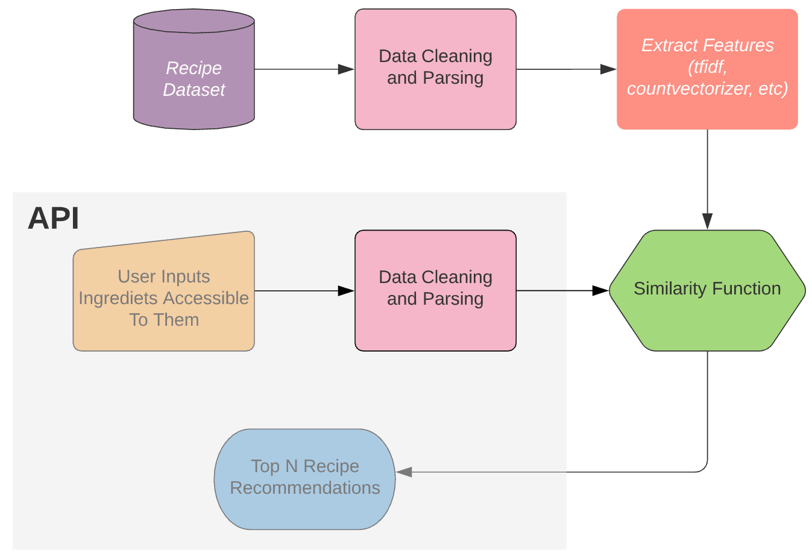

**The journey to my first ‘full-stack’ data science project (part 2) — building and deployment**

So… the idea: Given a list of ingredients, what are different recipes I can make? That is, what recipes can I make with the food I have in my apartment?

<!--truncate-->

First things first, if you would like to see my API in action (or use it!) then please do so by following (I have updated the app and release a new blog on it soon):

https://share.streamlit.io/jackmleitch/whatscooking-deployment/streamlit.py

In my first blog post on this project, I walked through how I scraped the data for this project. The data being cooking recipes and the corresponding ingredients. Since then I have added more recipes so we now have a total of 4647. Please feel free to make use of this dataset yourself, you can find it on my [Github](https://github.com/jackmleitch/Whatscooking-).

This post will be focused on preprocessing the data, building the recommendation system, and then finally deploying the model using Flask and Heroku.

The process to build the recommendation system is as follows:


We start by cleaning and parsing the dataset, then we extract the numerical features from the data, from here we can apply a similarity function to find the similarity between **ingredients for known recipes** and the **ingredients given by the end-user**. Finally, we can get the top-recommended recipes according to the similarity score.

Unlike the first article in this series, this will not be a tutorial of the tools I used, but it will describe how I built the system and why I made the decisions I did along the way. Although, the code comments do a good job of explaining things in my opinion — so check them out if you’re curious. As with most projects, my aim was to create the simplest model I could to get the job done to the standard I desired.

## Preprocessing and Parsing of Ingredients

To understand the task at hand here, let's look at an example. The delicious ‘Gennaro’s classic spaghetti carbonara’ recipe found on Jamie Oliver’s [website](https://www.jamieoliver.com/recipes/pasta-recipes/gennaro-s-classic-spaghetti-carbonara/) requires the ingredients:

- 3 large free-range egg yolks

- 40 g Parmesan cheese, plus extra to serve

- 1 x 150 g piece of higher-welfare pancetta

- 200 g dried spaghetti

- 1 clove of garlic

- extra virgin olive oil

There is a lot of redundant information here; for example, weights and measures are not going to add value to the vector encodings of the recipe. If anything, it is going to make distinguishing between recipes more difficult. So we need to get rid of those. A quick google search led me to a [Wikipedia page](https://en.wikibooks.org/wiki/Cookbook:Units_of_measurement) containing a list of standard cooking metrics e.g. clove, gram (g), teaspoon, etc. Removing all these words in my ingredient parser worked really well.

We also want to remove stop words from our ingredients. In NLP ‘stop words’ refer to the most common words in a language. For example, the sentence ‘learning about what stop words are’, becomes, ‘learning stop words’. NLTK provides us with an easy way to remove (most of) these words.

There are also other words in the ingredients that are useless to us — these are the words that are very common among recipes. Oil, for example, is used in most recipes and will provide little to no distinguishing power between recipes. Also, most people have oil in their homes so having to write oil every time you use the API is cumbersome and pointless. There are advanced NLP techniques, for example using [conditional random fields](https://open.blogs.nytimes.com/2015/04/09/extracting-structured-data-from-recipes-using-conditional-random-fields/) (a class of statistical modeling), that can calculate the probability that a word is an ingredient, as opposed to a measure, texture, or another type of word that surrounds the ingredient word. But, simply removing the most common words seemed to be very effective, so I did this. Occam’s razor and all that jazz… To get the most common words we can do the following:

```py
import nltk
vocabulary = nltk.FreqDist()
# This was done once I had already preprocessed the ingredients
for ingredients in recipe_df['ingredients']:
    ingredients = ingredients.split()
    vocabulary.update(ingredients)
for word, frequency in vocabulary.most_common(200):
    print(f'{word};{frequency}')
```

We have one final obstacle to get over, however. When we try to remove these ‘junk’ words from our ingredient list, what happens when we have different variations of the same word? What happens if we want to remove every occurrence of the word ‘pound’ but the recipe ingredients say ‘pounds’? Luckily there is a pretty trivial workaround: lemmatization and stemming. Stemming and lemmatization both generate the root form of inflected words — the difference is that a stem might not be an actual word whereas, a lemma is an actual language word. Although lemmatization is often slower, I chose to use this technique as I know the ingredients will be actual words which is useful for debugging and visualization (the results turned out to be practically identical using stemming instead). When the user feeds ingredients to the API we also lemmatize those words as the lemmatized words are the words with the embeddings.

We can put this all together in a function, `ingredient_parser`, along with some other standard preprocessing: getting rid of punctuation, removing accents, making everything lowercase, getting rid of Unicode.

```py title="/src/parse_ingredients.py"
def ingredient_parser(ingredients):
    # measures and common words (already lemmatized)
    measures = ['teaspoon', 't', 'tsp.', 'tablespoon', 'T', ...]
    words_to_remove = ['fresh', 'oil', 'a', 'red', 'bunch', ...]
    # Turn ingredient list from string into a list
    if isinstance(ingredients, list):
       ingredients = ingredients
    else:
       ingredients = ast.literal_eval(ingredients)
    # We first get rid of all the punctuation
    translator = str.maketrans('', '', string.punctuation)
    # initialize nltk's lemmatizer
    lemmatizer = WordNetLemmatizer()
    ingred_list = []
    for i in ingredients:
        i.translate(translator)
        # We split up with hyphens as well as spaces
        items = re.split(' |-', i)
        # Get rid of words containing non alphabet letters
        items = [word for word in items if word.isalpha()]
        # Turn everything to lowercase
        items = [word.lower() for word in items]
        # remove accents
        items = [unidecode.unidecode(word) for word in items]
        # Lemmatize words so we can compare words to measuring words
        items = [lemmatizer.lemmatize(word) for word in items]
        # get rid of stop words
        stop_words = set(corpus.stopwords.words('english'))
        items = [word for word in items if word not in stop_words]
        # Gets rid of measuring words/phrases, e.g. heaped teaspoon
        items = [word for word in items if word not in measures]
        # Get rid of common easy words
        items = [word for word in items if word not in words_to_remove]
        if items:
           ingred_list.append(' '.join(items))
           ingred_list = ' '.join(ingred_list)
    return ingred_list
```

When parsing the ingredients for ‘Gennaro’s classic spaghetti carbonara’ we get: egg yolk parmesan cheese pancetta spaghetti garlic. Perfect, that works fantastically!

Using lambda functions, it’s easy to parse all of the ingredients.

```py
recipe_df = pd.read_csv(config.RECIPES_PATH)
recipe_df['ingredients_parsed'] = recipe_df['ingredients'].apply(lambda x: ingredient_parser(x))
df = recipe_df.dropna()
df.to_csv(config.PARSED_PATH, index=False)
```

## Extracting Features

We now need to encode each document (recipe ingredients), and as before, simple models worked really well. One of the most basic models that should always be tried when doing NLP is **bag of words**. This entails creating a huge sparse matrix that stores counts of all the words in our corpus (all of the documents i.e. all of the ingredients for every recipe). Scikit-learn’s CountVectorizer has a nice implementation for this.

Bag of words performed ok but **TF-IDF** (term frequencies-inverse document frequency) marginally out-performed it, so we opted for this instead. I’m not going to go into the details of how tf-idf works as it is not relevant to the blog but it basically does what it says on the tin. As per usual, Scikit-learn has a lovely implementation of this: TfidfVectorizer. I then saved the model and encodings using pickle, as retraining the model every time the API is used would make it painfully slow.

```py title="/src/feature_extraction.py"
import pandas as pd
from sklearn.feature_extraction.text import TfidfVectorizer
import pickle
import config
# load in parsed recipe dataset
df_recipes = pd.read_csv(config.PARSED_PATH)
# Tfidf needs unicode or string types
df_recipes['ingredients_parsed'] =       df_recipes.ingredients_parsed.values.astype('U')
# TF-IDF feature extractor
tfidf = TfidfVectorizer()
tfidf.fit(df_recipes['ingredients_parsed'])
tfidf_recipe = tfidf.transform(df_recipes['ingredients_parsed'])
# save the tfidf model and encodings
with open(config.TFIDF_MODEL_PATH, "wb") as f:
     pickle.dump(tfidf, f)
with open(config.TFIDF_ENCODING_PATH, "wb") as f:
     pickle.dump(tfidf_recipe, f)
```

## Recommendation System

This application simply consists of text data and there is no kind of ratings available, **so we can not use** matrix decomposition methods, such as SVD and correlation coefficient-based methods.

We use content-based filtering which enables us to recommend recipes to people based on the attributes (ingredients) the user provides. To measure the similarity between documents I used **Cosine similarity**. I also tried using Spacy and KNN but cosine similarity won in terms of performance (and ease).

Mathematically, cosine similarity measures the cosine of the angle between two vectors. For the mathematically inclined out there, this is the same as the inner product of the same vectors normalized to both have length 1. I chose to use this measure of similarity as even if the two similar documents are far apart by the Euclidean distance (due to the size of the document), chances are they may still be oriented closer together. For example, if the user inputs a lot of ingredients and only the first half match with a recipe, we should, in theory, still get a good recipe match. In cosine similarity, the smaller the angle, the higher the cosine similarity: so we are trying to maximize this score.

```py
from sklearn.metrics.pairwise import cosine_similarity
from sklearn.feature_extraction.text import TfidfVectorizer
import pickle
import config
from ingredient_parser import ingredient_parser
# load in tdidf model and encodings
with open(config.TFIDF_ENCODING_PATH, 'rb') as f:
     tfidf_encodings = pickle.load(f)
with open(config.TFIDF_MODEL_PATH, "rb") as f:
     tfidf = pickle.load(f)
# parse the ingredients using my ingredient_parser
try:
    ingredients_parsed = ingredient_parser(ingredients)
except:
    ingredients_parsed = ingredient_parser([ingredients])
# use our pretrained tfidf model to encode our input ingredients
ingredients_tfidf = tfidf.transform([ingredients_parsed])
# calculate cosine similarity between actual recipe ingreds and test ingreds
cos_sim = map(lambda x: cosine_similarity(ingredients_tfidf, x), tfidf_encodings)
scores = list(cos_sim)
```

I then wrote a function, `get_recommendations`, to rank these scores and output a pandas data frame containing all the details of the top **N** recipes.

```py title="/src/recommendation_system.py"
def get_recommendations(N, scores):
    # load in recipe dataset
    df_recipes = pd.read_csv(config.PARSED_PATH)
    # order the scores with and filter to get the highest N scores
    top = sorted(range(len(scores)), key=lambda i: scores[i], reverse=True)[:N]
    # create dataframe to load in recommendations
    recommendation = pd.DataFrame(columns = ['recipe', 'ingredients', 'score', 'url'])
    count = 0
    for i in top:
        recommendation.at[count, 'recipe'] = title_parser(df_recipes['recipe_name'][i])

        recommendation.at[count, 'ingredients'] = ingredient_parser_final(df_recipes['ingredients'][i])

        recommendation.at[count, 'url'] = df_recipes['recipe_urls'][i]
        recommendation.at[count, 'score'] = "{:.3f}".format(float(scores[i]))

        count += 1
    return recommendation
```

It’s worth noting that there was no concrete way of assessing the performance of the model so I had to evaluate the recommendations manually. To be honest though, this ended up actually being quite fun… I also discovered a tonne of new recipes! It’s comforting to see that when we put in the ingredients (before they are parsed of course!) for our beloved Gennaro’s classic spaghetti carbonara we get the correct recommendation with a score of 1.

As of right now, a few items in my fridge/cupboards are: ground beef, pasta, spaghetti, tomato pasta sauce, bacon, onion, zucchini, and, cheese. Our newly built recommendation system suggests we make:

```py
{ "ingredients" :
    "1 (15 ounce) can tomato sauce, 1 (8 ounce) package uncooked pasta shells, 1 large zucchini - peeled and cubed, 1 teaspoon dried basil, 1 teaspoon dried oregano, 1/2 cup white sugar, 1/2 medium onion, finely chopped, 1/4 cup grated Romano cheese, 1/4 cup olive oil, 1/8 teaspoon crushed red pepper flakes, 2 cups water, 3 cloves garlic, minced",

  "recipe" : "Zucchini and Shells",

  "score: "0.760",

  "url":"https://www.allrecipes.com/recipe/88377/zucchini-and-shells/"}
```

Sounds good to me — best get cooking!

## Create an API to Deploy the Model

### Deployment using Flask

So how can I serve this model I have built to an end-user? I created an API that can be used to input ingredients and in turn, it outputs the top 5 recipe recommendations based on those ingredients. To build this API I used Flask, which is a micro web service framework.

```py title="/src/app.py"
from flask import Flask, jsonify, request
import json, requests, pickle
import pandas as pd
from sklearn.feature_extraction.text import TfidfVectorizer
from sklearn.metrics.pairwise import cosine_similarity
from ingredient_parser import ingredient_parser
import config, rec_sys
app = Flask(__name__)
@app.route('/', methods=["GET"])
def hello():
    # This is the homepage of our API.
    # It can be accessed by http://127.0.0.1:5000/
    return HELLO_HTML
HELLO_HTML = """
     <html><body>
         <h1>Welcome to my api: Whatscooking!</h1>
         <p>Please add some ingredients to the url to receive recipe recommendations.
            You can do this by appending "/recipe?ingredients= Pasta Tomato ..." to the current url.
         <br>Click <a href="/recipe?ingredients= pasta tomato onion">here</a> for an example when using the ingredients: pasta, tomato and onion.
     </body></html>
     """
@app.route('/recipe', methods=["GET"])
def recommend_recipe():
    # This is our endpoint. It can be accessed by http://127.0.0.1:5000/recipe
    ingredients = request.args.get('ingredients')
    recipe = rec_sys.RecSys(ingredients)

    # We need to turn output into JSON.
    response = {}
    count = 0
    for index, row in recipe.iterrows():
        response[count] = {
                            'recipe': str(row['recipe']),
                            'score': str(row['score']),
                            'ingredients': str(row['ingredients']),
                            'url': str(row['url'])
                          }
        count += 1
    return jsonify(response)
if __name__ == "__main__":
   app.run(host="0.0.0.0", debug=True)
```

We can start this API by running the command `python src/app.py` and the API will start on localhost on port 5000. We can access recipe recommendations for the inputs pasta, tomato, and onion by visiting http://192.168.1.51:5000/recipe?ingredients=%20pasta%20tomato%20onion in our browser.


### Deploying Flask API to Heroku — It’s Time To Go Online

Deploying a Flask API to Heroku is extremely easy if you use Github! First, I created a file in my project folder called Procfile, with no extension. All you need to put inside this file is:

`web: gunicorn app:app`

The next step was to create a file called `requirements.txt` which consists of all of the python libraries that I used for this project. If you’re working in a virtual environment (I use conda) then it’s as easy as `pip freeze > requirements.txt` — make sure you're in the correct working directory otherwise it’ll save the file somewhere else.

All I had to do now was commit the changes to [my Github repository](https://github.com/jackmleitch/whatscooking-deployment) and follow the deployment steps on https://dashboard.heroku.com/apps. If you would like to try out or use my API, please do by visiting:

- https://whats-cooking-recommendation.herokuapp.com/- if you are in USA

- https://whatscooking-deployment.herokuapp.com/- if you are in Europe

- Either should work if you are elsewhere, it’ll just be a tad slower

### Docker

We have now reached the stage where I am happy with the model I have built, so I want to be able to distribute my model to others so that they can use it too. I have uploaded my whole project to [Github](https://github.com/jackmleitch/Whatscooking-) but that's not quite enough. Just because the code works on my computer does not mean it's going to work on someone else's computer, this could be because of many reasons. It would be fantastic if when I distribute my code, I replicate my computer so that I know it is going to work. One of the most popular ways of doing this nowadays is by using [Docker Containers](https://github.com/jackmleitch/Whatscooking-).

The first thing I did was create a **docker file** called Dockerfile (it doesn't have an extension). Simply put, the docker file tells us how to build our environment and contains all the commands a user could call in the command line to assemble the image.

```py title="Dockerfile"
# Include where we get the image from (operating system)
FROM ubuntu:18.04
MAINTAINER Jack Leitch 'jackmleitch@gmail.com'
# We cannot press Y so we do it automatically.
RUN apt-get update && apt-get install -y \
    git \
    curl \
    ca-certificates \
    python3 \
    python3-pip \
    sudo \
    && rm -rf /var/lib/apt/lists/*
# Set working directory
WORKDIR /app
# Copy everything in currect directory into the app directory.
ADD . /app
# Install all of the requirements
RUN pip3 install -r requirements.txt
# Download wordnet as its used to lemmatize
RUN python3 -c "import nltk; nltk.download('wordnet')"
# CMD executes once the container is started
CMD ["python3", "app.py"]
```

Once I created the docker file, I then needed to build my container — and that's very easy. Side note: if you do this, make sure all your file paths (I keep mine in a `config.py` file) aren’t specific to your computer because docker is like a virtual machine and contains its own file system e.g. you can put `./input/df_recipes.csv` instead.

`docker build -f Dockerfile -t whatscooking:api`

To start our API, on any machine (!), all we have to do now is (assuming you have downloaded the docker container):

`docker run -p 5000:5000 -d whatscooking:api`

If you want to check out the container yourself, here is a link to my [Docker Hub](https://hub.docker.com/repository/docker/jackmleitch/whatscooking). You can pull the image by:

`docker pull jackmleitch/whatscooking:api`

The plan moving forward from here is to build a nicer interface to the API using Streamlit.
