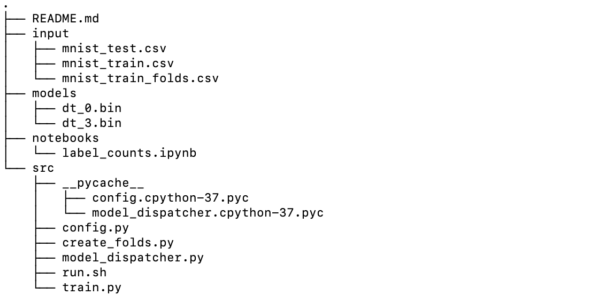
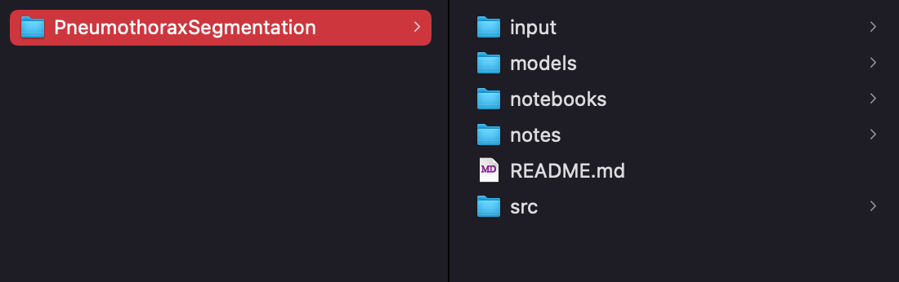
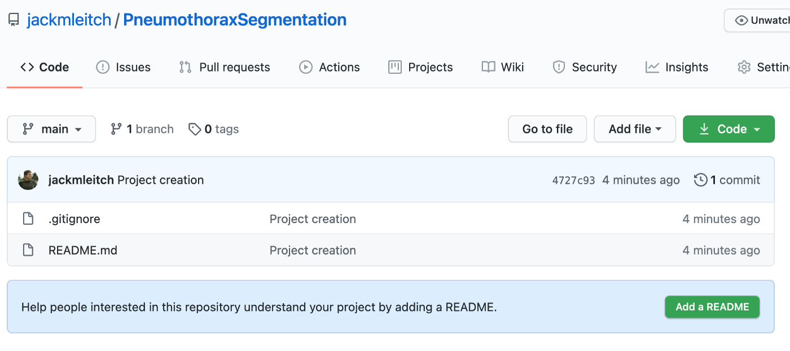

**Using Python to automate the process of setting up new project directories and making the first commit to a new repository in Github**

I find myself doing the same thing over and over again when starting a new data science project. As well as it being extremely tedious (and frustrating when I can’t remember how to use git…), it's also just a waste of time. Inspired by the YouTuber [Kalle Hallden](https://www.youtube.com/channel/UCWr0mx597DnSGLFk1WfvSkQ), I decided to try and automate this process using Python.

<!--truncate-->

As discussed in one of my previous blog posts, [Organizing machine learning projects](https://towardsdatascience.com/organizing-machine-learning-projects-e4f86f9fdd9c), whenever I start a new project I like to use the same file system. Putting everything into folders named src, input, models, notebooks, and notes make it super easy to find the files I'm looking for lending itself nicely to code reproducibility. An example file structure looks like this:



The first thing I did was make a checklist of what I wanted my custom bash function to do:

- Create a folder with the project name inside my Projects folder

- Create folders inside this folder named: `src`, `input`, `models`, `notebooks`, `notes`

- Use Github API to create a new repository with the project name

- Add a `README.md`, a `.gitignore`, and a `notes.txt`

- Do the standard git stuff — `init`, `add`, `commit`, `remote`, and `push`

## The Build

This turned out to be a relatively simple build and the only packages that I need to install were **PyGithub** to use the Github API, and **python-dotenv** to make use of environment variables.

```py
pip install PyGithub
pip install python-dotenv
```

Inside a `.env` file, I added the hardcoded stuff and my personal Github information. We can access our Github account using the API with our username and password but instead, I generated a personal token [here](https://github.com/settings/tokens). This is more secure and was actually easier to do.

I then wrote a function `create.py` which creates the file system described above with the main directory being the project title. It also uses the Github API to create a repository on Github with the project name.

```py title="/src/create.py"
import sys
import os
from dotenv import load_dotenv
from github import Github

load_dotenv()

# Get data from a .env file thats in .gitignore
path = os.getenv("FILEPATH")
# Access to token generated from github
token = os.getenv("TOKEN")
subFolders = ['input', 'src', 'models', 'notebooks', 'notes']


def create():
    # Extract project name from the command line
    folderName = str(sys.argv[1])
    # Make directory in my files
    os.makedirs(path+str(folderName))
    # Adds in sub-directories of src, input, ...
    for i in range(0, len(subFolders)):
        subPath = str(path) + str(folderName) + '/' + str(subFolders[i])
        os.makedirs(subPath)

    # Uses Githubs API to create repository
    user = Github(token).get_user()
    repo = user.create_repo(folderName)
    print(f"Succesfully created repository {folderName}")

if __name__ == "__main__":
    create()
```

`sys.argv` is the list of command-line arguments passed to the Python program. So `sys.argv[1]` gives us the project name if we, for example, write `python create.py ProjectName` in the terminal.

I then use my personal Github token (stored in .env) to access my Github account and create a new repository named ProjectName (or whatever you write after you call `create.py`).

The next step was to write a shell script to call this function and then initialize the git repository.

```sh title="/src/.create.sh"
#!/bin/bash

# . means to source the contents of this file into the current shell

function create() {
    cd '/Users/Jack/Documents/Projects/project_auto/'
    source .env
    # $1 is the first positional argument in the script
    python create.py $1

    # Add notes.txt file to notes folder
    cd $FILEPATH$1/notes/
    echo Notes > notes.txt

    # The standard git stuff
    cd $FILEPATH$1
    echo 'notes/' >> .gitignore
    echo '__pycache__/' >> .gitignore
    touch README.md
    git init -b main
    git add .
    git commit -m "Project creation"
    git remote add origin https://github.com/$USERNAME/$1
    git push -u origin main
}
```

This **create** function is the end product. It first sets the directory to the home of this project and calls the `create.py` function — the $1 here refers to the first argument after the terminal function. For example, if we run `create MNIST` in the terminal, this function will subsequently run `create.py MNIST` and create a project titled MNIST.

A `notes.txt` file is then added to the notes folder, this is then added, along with the pycache, to the `.gitignore` file. After this, a `README.md` is created and the whole directory is then committed to our newly created repository. Finally, the remote is added to the directory and it is all pushed to Github.

The last piece of the puzzle was to add this `.create.sh` script to the `bash_profile`, this is the initialization file for configuring the user environment. To put it simply, the create function will now be loaded into the terminals ‘library’. So whenever I now load up my terminal, I can easily just call on the create function. On macOS we can do this by:

```sh
cd
nano .bash_profile
```

This then opens up the `bash_profile`. We can then add the following line of code to the profile.

```sh
source /PATH_TO_THE_FILE/.create.sh
```

Lastly, to update the new changes we just run the same line again in the terminal.

## Testing Everything Out

Let’s test our new found automatic abilities out! We can run the following in the terminal:

```sh
create PneumothoraxSegmentation
```

In our projects folder, we can now see a new file!



And on my Github page, I now have a new repository!



Job done. This was a nice quick and easy automation that is going to make my life (and hopefully yours) a lot easier. With two simple scripts, we were able to fully automate the mundane tasks involved in creating a new data science project. I hope this post inspires you to start automating more of your data science workflow!

Thanks for reading and I hope you enjoyed it.
