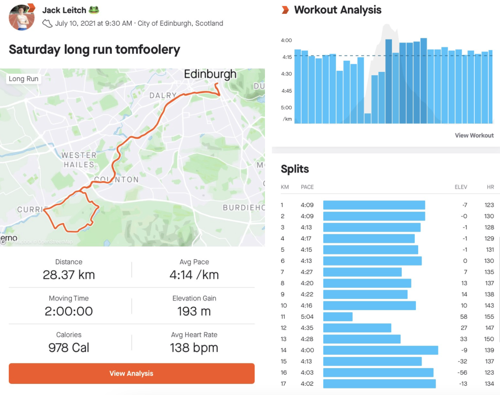
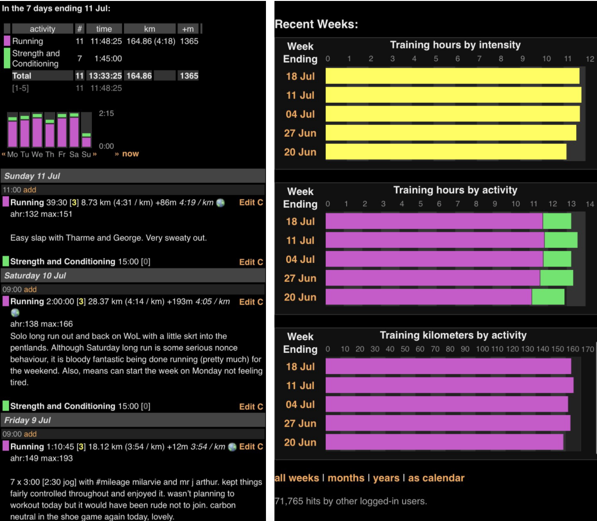

**Automating away those unceasing repetitive tasks the easy way**

## The Task At Hand

Being the avid runner and data lover that I am, naturally, I like to get the best out of logging my training. The solution I settled with a few years back was to log my training on both Strava, and Attackpoint. While both platforms provide a service for tracking exercise using GPS data, Strava has an emphasis on being a social network and it allows you to look into each activity in an in-depth way, something that Attackpoint lacks; Attackpoint on the other hand is more barebone and I personally prefer it for looking at my training as a whole (in timescales of weeks/months/years).

<!--truncate-->

|  |  |
| ------------------------------------- | --------------------------------- |

The one problem I have, however, is that I always struggle to keep both of these logs up to date. Garmin (the maker of my running watch) syncs up with both websites, via an API, so my runs magically appear on both websites, so the problem isn't that my runs are only appearing on one website. The problem I have is that keeping both websites up to date with run notes/descriptions is a tedious affair. I tend to always keep Strava up to date and dip in and out of posting on Attackpoint whenever I can be bothered. So why not just automate away my commitment issues to these websites?

**The task: every time I run and write about it on Strava, take that description and add it to the corresponding run post on Attackpoint.**

## The Game Plan

So I had a why, all that was left was to figure out how. Choosing to go from Strava to Attackpoint, and not the other way around, was an easy one. Firstly, Strava is way nicer to use, and secondly, the website is more modern, slick, and fancy so writing code to post and interact with it, although doable, would be more of a challenge. So how did I actually do this?

Enter Selenium. Selenium is a Python package that launches and controls a web browser. It is able to fill in forms and simulate mouse clicks in this browser. An excellent tutorial on Selenium, which I used a lot, can be found [here](https://towardsdatascience.com/controlling-the-web-with-python-6fceb22c5f08).

With these kinds of things, I find that it's always good to write down a plan of action; whether that be on paper or on your computer, it's totally down to personal preference, I tend to go paper. More often than not I end up deviating substantially from the initial plan when things inevitably go wrong but either way, I find writing down initial ideas/thoughts provides clarity and gives me a sense of direction.

So here is a rough outline of how I chose to automate this task:

- Make a call to the Strava API to get an ordered list of my recent run's unique IDs. This wasn't originally in the plan but obtaining my activities + the corresponding information in time order from Strava proved way harder than I initially thought due to added complications (for example, a lot of my runs group runs, and the html gets tricky here). Having these IDs made extracting the information was easier.

```py title="/src/strava_api.py"
import pandas as pd
import requests
import json

import config

def get_strava_run_ids(id_num=10):
    auth_url = "https://www.strava.com/oauth/token"
    activites_url = "https://www.strava.com/api/v3/athlete/activities"
    # my personal strava API information
    payload = config.STRAVA_PAYLOAD
    # check if there is a new request token
    res = requests.post(auth_url, data=payload, verify=False)
    access_token = res.json()["access_token"]

    header = {"Authorization": "Bearer " + access_token}
    param = {"per_page": id_num, "page": 1}
    # make the request to the strava API
    my_dataset = requests.get(activites_url, headers=header, params=param).json()

    # store list of recent (ordered) IDs
    id_list = []
    for activity in my_dataset:
        id_list.append(activity.get("id"))
    return id_list

if __name__ == "__main__":
    # test
    ids = get_strava_run_ids()
    print(ids)
```

- Use Selenium to log in to Strava, navigate to the ‘Your Activities’ tab, retrieve the information for runs corresponding to each unique activity ID. As you can see in the code below, Selenium couldn't be easier to use as it's so intuitive. The code below is a rough skeleton, the full code + comments can be found on my [Github](https://github.com/jackmleitch/strava2ap) page.

```py title="/src/strava_selenium.py"
from selenium import webdriver
from webdriver_manager.chrome import ChromeDriverManager

import config
from utils import remove_emoji
from stravaAPI import get_strava_run_ids


def fetch_strava_activities(num_of_activities=6):
    # website login details
    strava_login = config.STRAVA_LOGIN
    # use Chrome to access web (will update chrome driver if needed)
    driver = webdriver.Chrome(ChromeDriverManager().install())
    # open the website
    driver.get("https://www.strava.com/login")

    # add username and password and login
    name_box = driver.find_element_by_name("email")
    name_box.send_keys(strava_login.get("email"))
    pass_box = driver.find_element_by_name("password")
    pass_box.send_keys(strava_login.get("password"))
    login_button = driver.find_element_by_id("login-button").click()

    # filter the feed to only my activities
    following_button = driver.find_element_by_id("feed-filter-btn").click()
    your_activities = driver.find_element_by_xpath(
        "//a[@href='/dashboard?feed_type=my_activity']"
    ).click()

    # use strava API to get ids for latest runs
    ids = get_strava_run_ids(num_of_activities)

    # get i latest runs and run details
    strava_activities = {}
    for i, id in enumerate(ids):

        # group runs and non-group runs have different css classes so we need to treat separately
        try:
            content = driver.find_element_by_xpath(
                f'//div[@id="Activity-{id}" and @class="activity feed-entry card"]'
            )
            entry_body = content.find_element_by_class_name("entry-body")
        except:
            try:
                content = driver.find_element_by_xpath(
                        f'//li[@id="Activity-{id}" and @class="activity child-entry"]'
                    )
                entry_body = content.find_element_by_xpath('//div[@class="entry-body entry-inset"]')
            except:
                print(f"No activity with id = {id} found")
                continue

        # get run title
        title = entry_body.find_elements_by_css_selector("a")[0].text
        # some runs have no description
        if len(entry_body.find_elements_by_css_selector("a")) > 1:
            description = entry_body.find_elements_by_css_selector("a")[1].text
        else:
            description = ""
        # remove emojis from title and description as attackpoint cant deal with them
        title = remove_emoji(title)
        description = remove_emoji(description)
        # get run distance, pace, and time
        distance = entry_body.find_elements_by_css_selector("b")[0].text
        pace = entry_body.find_elements_by_css_selector("b")[1].text
        time = entry_body.find_elements_by_css_selector("b")[2].text

        # store results in a dictionary
        if title:
           strava_activities[f"activity_{i}"] = {
               "title": title,
               "description": description,
               "distance": distance,
               "time": time,
               "pace": pace,
           }
        # quit driver
        driver.quit()
        return strava_activities

# check
if __name__ == "__main__":
    activities = fetch_strava_activities()
    print(activities)
```

- Now we have all my most recent activities (in order of completion!) along with the activities details: time, title, description, distance, and pace. All that is left to do now is add the title and descriptions to my Attackpoint page, although there are a few minor subtleties. First of all, if any activities have descriptions already I want to leave them alone. Secondly, if any of the Strava titles are the default i.e. haven't been changed, I also want to leave the post alone as I haven't gotten around to name the Strava run yet. As with before, some code details have been left out for clarity.

```py title="/src/attackpoint_selenium.py"
from selenium import webdriver
from webdriver_manager.chrome import ChromeDriverManager

import config
from utils import format_time, get_pace, get_dates
from stravaSelenium import fetch_strava_activities


def attackpoint_login():
    # similar to strava login
    ...
    return driver

def fetch_attackpoint_activities(days=3):
    ...
    return ap_activities

def update_description(days=2):
    # fetch recent activities from strava
    strava = fetch_strava_activities(num_of_activities=int(days * 4))
    # fetch recent activities from attackpoint
    attackpoint = fetch_attackpoint_activities(days=days)

    # get a list of activity descriptions to post on attackpoint
    descriptions = []
    for i in range(0, min(len(strava), len(attackpoint))):
        # get activity titles and descriptions from the strava data collected
        activity_title = strava[f"activity_{i}"]["title"]
        activity_description = strava[f"activity_{i}"]["description"]
        ...
        descriptions.append(activity_post)

    # counters to keep track of things
    counter_activities = -1
    activities_edited = 0
    # if these titles are on strava then dont update activity description on ap
    strava_default_titles = ["Morning Run", ...]
    # loop through days
    for day in get_dates(days=days):
        # go onto the days activity
        try:
            check_activity_date = driver.find_element_by_xpath(
                f'//a[@href="/viewlog.jsp/user_13190/period-1/enddate-{day}"]'
            ).click()
        except:
            continue
        edit_button = driver.find_elements_by_xpath('//*[@title="Edit this entry"]')
        # loop over each activity on given day
        for i, item in enumerate(edit_button):
            edit_button = driver.find_elements_by_xpath('//*[@title="Edit this entry"]')
            # reverse edit_button to get activities in order
            edit_button = edit_button[::-1]
            edit_button[i].click()
            distance = driver.find_element_by_id("distance").get_attribute("value")
            # if not a run then ignore
            if not distance:
                driver.back()
            else:
                counter_activities += 1
                description = driver.find_element_by_class_name(
                    "logtextarea"
                ).get_attribute("value")
                # if no description then ignore
                if description:
                    driver.back()
                # if there is no description then we can add one!
                if not description:
                    strava_title = strava[f"activity_{counter_activities}"]["title"]
                    # if title is not on default strava titles
                    if strava_title not in strava_default_titles:
                        activities_edited += 1
                        text_input = driver.find_element_by_class_name("logtextarea")
                        text_input.send_keys(descriptions[counter_activities])
                        submit = driver.find_element_by_xpath(
                            "//input[@value='Submit']"
                        ).click()
                    else:
                        driver.back()
        driver.get("https://www.attackpoint.org/log.jsp/user_13190")
    driver.quit()
    print(f"\n{activities_edited} activity descriptions posted")


if __name__ == "__main__":
    update_description()
```

And we are done, if I run `attackpointSelenium.py` in the terminal it will add any missing descriptions to my Attackpoint!

## Making The Automatic Fully Automatic

Obviously running a line of code once or twice a day is WAY too much effort so the last thing that was left to do was deploy the code online somewhere so that I was completely out of the loop. Following this excellent [tutorial](https://medium.com/analytics-vidhya/schedule-a-python-script-on-heroku-a978b2f91ca8) I was able to deploy my code to [Heroku](https://id.heroku.com/login) and schedule it so that my code checks to see if my Attackpoint needs updating every 10 minutes! And best of all, it's completely free.

:::info
TL;DR wrote code to automatically post information from one website onto the corresponding section of another.
:::

Code: https://github.com/jackmleitch/strava2ap
