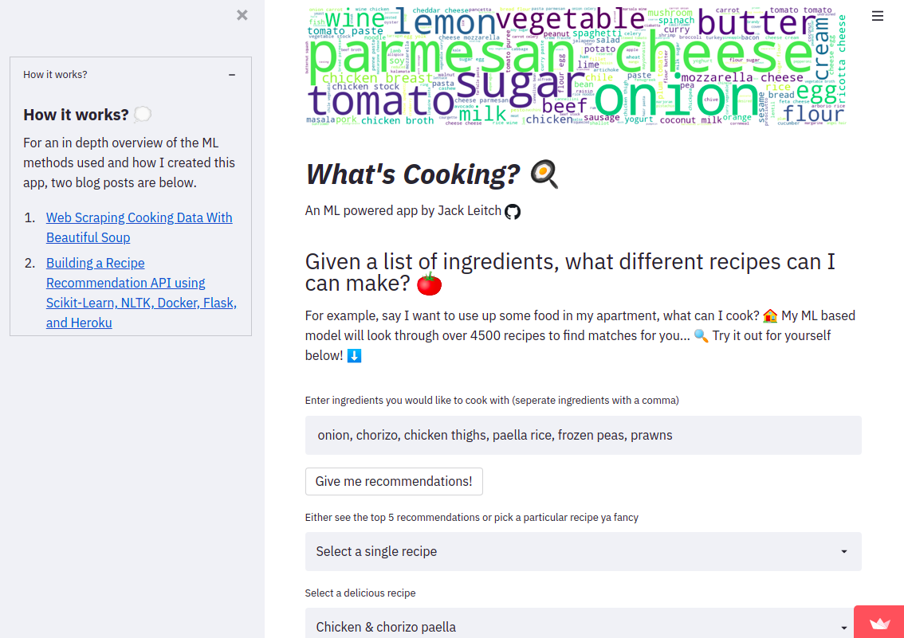
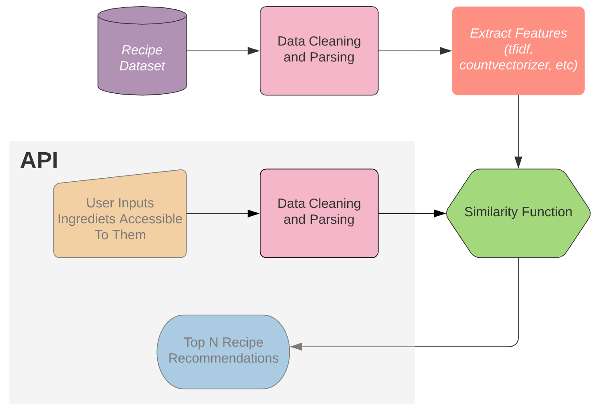
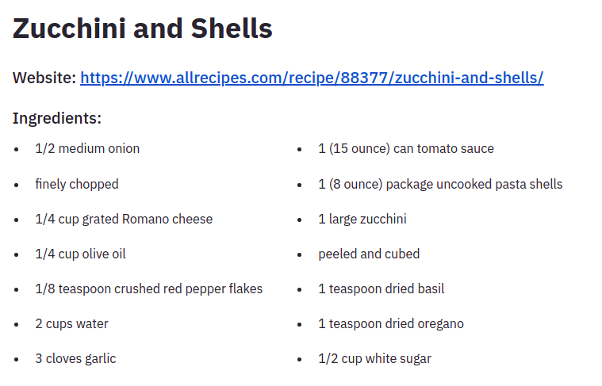

**Using Word2Vec, Scikit-Learn, and Streamlit**

First things first, If you would like to play around with the finished app. You can here: https://share.streamlit.io/jackmleitch/whatscooking-deployment/streamlit.py.



In a previous blog post (Building a Recipe Recommendation API using Scikit-Learn, NLTK, Docker, Flask, and Heroku) I wrote about how I went about building a recipe recommendation system. To summarize: I first cleaned and parsed the ingredients for each recipe (for example, 1 diced onion becomes onion), next I **encoded each recipe ingredient list using TF-IDF**. From here I applied a similarity function to find the similarity between **ingredients for known recipes and the ingredients given by the end-user**. Finally, we can get the top-recommended recipes according to the similarity score.

<!--truncate-->



However, after using my new API for a while I wanted to improve on two things:

1. Sometimes the ingredients in the recommendations didn't line up well with the input ingredients, so I needed some better embeddings.

2. The Flask API was well in need for a good makeover.

Enter Gensim’s **Word2Vec** and **Streamlit**.

## Preprocessing and Parsing of Ingredients

To understand the task at hand here, let’s look at an example. The delicious ‘Gennaro’s classic spaghetti carbonara’ recipe found on Jamie Oliver’s [website](https://www.jamieoliver.com/recipes/pasta-recipes/gennaro-s-classic-spaghetti-carbonara/) requires the ingredients:

- 3 large free-range egg yolks

- 40 g Parmesan cheese, plus extra to serve

- 1 x 150 g piece of higher-welfare pancetta

- 200 g dried spaghetti

- 1 clove of garlic

- extra virgin olive oil

There is a lot of redundant information here; for example, weights and measures are not going to add value to the vector encodings of the recipe. If anything, it is going to make distinguishing between recipes more difficult. So we need to get rid of those. A quick google search led me to a [Wikipedia page](https://en.wikibooks.org/wiki/Cookbook:Units_of_measurement) containing a list of standard cooking metrics e.g. clove, gram (g), teaspoon, etc. Removing all these words in my ingredient parser worked really well.

We also want to remove stop words from our ingredients. In NLP ‘stop words’ refer to the most common words in a language. For example, the sentence ‘learning about what stop words are’, becomes, ‘learning stop words’. NLTK provides us with an easy way to remove (most of) these words.

There are also other words in the ingredients that are useless to us — these are the words that are very common among recipes. Oil, for example, is used in most recipes and will provide little to no distinguishing power between recipes. Also, most people have oil in their homes so having to write oil every time you use the API is cumbersome and pointless. There are advanced NLP techniques, for example using [conditional random fields](https://open.blogs.nytimes.com/2015/04/09/extracting-structured-data-from-recipes-using-conditional-random-fields/) (a class of statistical modeling), that can calculate the probability that a word is an ingredient, as opposed to a measure, texture, or another type of word that surrounds the ingredient word. But, simply removing the most common words seemed to be very effective, so I did this. Occam’s razor and all that jazz… To get the most common words we can do the following:

```py title="/src/get_word_freq.py"
import nltk
vocabulary = nltk.FreqDist()
# This was done once I had already preprocessed the ingredients
for ingredients in recipe_df['ingredients']:
    ingredients = ingredients.split()
    vocabulary.update(ingredients)
for word, frequency in vocabulary.most_common(200):
    print(f'{word};{frequency}')
```

We have one final obstacle to get over, however. When we try to remove these ‘junk’ words from our ingredient list, what happens when we have different variations of the same word? What happens if we want to remove every occurrence of the word ‘pound’ but the recipe ingredients say ‘pounds’? Luckily there is a pretty trivial workaround: **lemmatization** and **stemming**. Stemming and lemmatization both generate the root form of inflected words — the difference is that a stem might not be an actual word whereas, a lemma is an actual language word. Although lemmatization is often slower, I chose to use this technique as I know the ingredients will be actual words which is useful for debugging and visualization (the results turned out to be practically identical using stemming instead). When the user feeds ingredients to the API we also lemmatize those words as the lemmatized words are the words with the corresponding vectorizations.

We can put this all together in a function, `ingredient_parser`, along with some other standard preprocessing: getting rid of punctuation, removing accents, making everything lowercase, getting rid of Unicode.

```py title="/src/parse_ingredients.py"
def ingredient_parser(ingredients):
    # measures and common words (already lemmatized)
    measures = ['teaspoon', 't', 'tsp.', 'tablespoon', 'T', ...]
    words_to_remove = ['fresh', 'oil', 'a', 'red', 'bunch', ...]
    # Turn ingredient list from string into a list
    if isinstance(ingredients, list):
       ingredients = ingredients
    else:
       ingredients = ast.literal_eval(ingredients)
    # We first get rid of all the punctuation
    translator = str.maketrans('', '', string.punctuation)
    # initialize nltk's lemmatizer
    lemmatizer = WordNetLemmatizer()
    ingred_list = []
    for i in ingredients:
        i.translate(translator)
        # We split up with hyphens as well as spaces
        items = re.split(' |-', i)
        # Get rid of words containing non alphabet letters
        items = [word for word in items if word.isalpha()]
        # Turn everything to lowercase
        items = [word.lower() for word in items]
        # remove accents
        items = [unidecode.unidecode(word) for word in items]
        # Lemmatize words so we can compare words to measuring words
        items = [lemmatizer.lemmatize(word) for word in items]
        # get rid of stop words
        stop_words = set(corpus.stopwords.words('english'))
        items = [word for word in items if word not in stop_words]
        # Gets rid of measuring words/phrases, e.g. heaped teaspoon
        items = [word for word in items if word not in measures]
        # Get rid of common easy words
        items = [word for word in items if word not in words_to_remove]
        if items:
           ingred_list.append(' '.join(items))
    return ingred_list
```

When parsing the ingredients for ‘Gennaro’s classic spaghetti carbonara’ we get: egg yolk, parmesan cheese, pancetta, spaghetti, garlic. Perfect, that works fantastically! Using `df.apply` when can easily parse the ingredients for each recipe.

## Word Embeddings Using Word2Vec

Word2Vec is a 2-layer neural network that produces word embeddings. It takes in a corpus of text as an input (a collection of individual documents) and maps each word to a vector in Euclidean space. The end goal is to have a text representation that captures **distributional similarities** between words. That is, words that often appear in similar contexts are mapped to vectors separated by a shorter Euclidean distance (the L2 norm).

In the context of recipe ingredients, Word2vec allowed me to capture similarities between recipe ingredients that are commonly used together. For example, mozzarella cheese which is commonly used when making pizza is most similar to other cheeses and pizza-related ingredients.

```py
print(model_cbow.wv.most_similar(u'mozzarella cheese'))
>>> [('parmesan cheese', 0.999547004699707), ('cheddar cheese', 0.9995082020759583),
    ('tomato', 0.9994533061981201), ('mushroom', 0.9994530081748962),
    ('cheese', 0.9994290471076965), ('mozzarella', 0.999423086643219),
    ('sausage', 0.9993994832038879), ('pepperoni', 0.9993913173675537),
    ('onion', 0.9993910193443298), ('chicken breast', 0.9993739724159241)]
```

I chose to use the **Continuous bag of words** (CBOW) variant of Word2Vec. CBOW tries to learn a language model that tries to predict the center word in a sliding window. Due to the fact that Word2Vec tries to predict words based on the word's surroundings, it was vital to sort the ingredients alphabetically. If I did not sort the ingredients with respect to a consistent criterion, the model would interpret ingredients in a different order as having different contexts.

The hyperparameters chosen are below:

- `size=100`, this refers to the dimensionality of the embeddings. I settled on 100 by trying 50, 100, 150 and seeing which performed best.

- `sg = 0`, this creates a CBOW model as opposed to a SkipGram model.

- `workers = 8`, the number of CPUs I have.

- `window = 6`, this is the size of the sliding window in which the center word is predicted. 6 was chosen as it is the average length of each document (ingredient list).

- `min_count = 1`, words below the min_count frequency are dropped before training occurs. 1 was chosen as I want all ingredients to have an embedding.

The Word2Vec training code is below. I used the popular python library Gensim.

```py title="/src/train_word2vec.py"
from gensim.models import Word2Vec

# get corpus with the documents sorted in alphabetical order
def get_and_sort_corpus(data):
    corpus_sorted = []
    for doc in data.parsed.values:
        doc.sort()
        corpus_sorted.append(doc)
    return corpus_sorted

# calculate average length of each document
def get_window(corpus):
    lengths = [len(doc) for doc in corpus]
    avg_len = float(sum(lengths)) / len(lengths)
    return round(avg_len)

if __name__ == "__main__:
    # load in data
    data = pd.read_csv('input/df_recipe.csv')
    # parse the ingredients for each recipe
    data['parsed'] = data.ingredients.apply(ingredient_parser)
    # get corpus
    corpus = get_and_sort_corpus(data)
    print(f"Length of corpus: {len(corpus)}")
    # train and save CBOW Word2Vec model
    model_cbow = Word2Vec(
      corpus, sg=0, workers=8, window=get_window(corpus), min_count=1, vector_size=100
    )
    model_cbow.save('models/model_cbow.bin')
    print("Word2Vec model successfully trained")
```

## Document Embeddings

In order to build the recipe recommendation, I needed to represent each document (each ingredient list) as a single embedding. This then allowed me to calculate corresponding similarities. So how can we use our word embeddings to compute a representative vector for the whole ingredient list? I tried out two different methods: one simple and one slightly more complicated. For this, I followed this excellent [tutorial](http://nadbordrozd.github.io/blog/2016/05/20/text-classification-with-word2vec/).

### Averaging Word Embeddings

This does what it says on the tin, it directly averages all word embeddings in each document. The code is adapted from [here](http://nadbordrozd.github.io/blog/2016/05/20/text-classification-with-word2vec/) and [here](https://towardsdatascience.com/nlp-performance-of-different-word-embeddings-on-text-classification-de648c6262b).

```py title="/src/mean_word_embeddings.py"
class MeanEmbeddingVectorizer(object):
    def __init__(self, model_cbow):
        self.model_cbow = model_cbow
        self.vector_size = model_cbow.wv.vector_size

    def fit(self):
        return self

    def transform(self, docs):
        doc_vector = self.doc_average_list(docs)
        return doc_word_vector

    def doc_average(self, doc):
        mean = []
        for word in doc:
            if word in self.model_cbow.wv.index_to_key:
                mean.append(self.model_cbow.wv.get_vector(word))

        if not mean:
            return np.zeros(self.vector_size)
        else:
            mean = np.array(mean).mean(axis=0)
            return mean

    def doc_average_list(self, docs):
        return np.vstack([self.doc_average(doc) for doc in docs])
```

### Using TF-IDF to Aggregate Embeddings

Here we do the same as above but instead, we do a weighted mean and scale each vector using its inverse document frequency (IDF). The IDF measures the importance of a term across the whole corpus. IDF will weigh down terms that are very common across a corpus (in our case words like olive oil, garlic, butter, etc.) and weighs up rare terms. This is useful for us as it will give us better distinguishing power between recipes as the ingredients that are scaled-down will be ingredients that the user will tend to not give as an input to the recommendation system.

```py title="/src/tfidf_word_embeddings.py"
class TfidfEmbeddingVectorizer(object):
    def __init__(self, model_cbow):

        self.model_cbow = model_cbow
        self.word_idf_weight = None
        self.vector_size = model_cbow.wv.vector_size

    def fit(self, docs):
        """
	Build a tfidf model to compute each word's idf as its weight.
	"""

        text_docs = []
        for doc in docs:
            text_docs.append(" ".join(doc))

        tfidf = TfidfVectorizer()
        tfidf.fit(text_docs)
        # if a word was never seen it is given idf of the max of known idf value
        max_idf = max(tfidf.idf_)
        self.word_idf_weight = defaultdict(
            lambda: max_idf,
            [(word, tfidf.idf_[i]) for word, i in tfidf.vocabulary_.items()],
        )
        return self

    def transform(self, docs):
        doc_word_vector = self.doc_average_list(docs)
        return doc_word_vector

    def doc_average(self, doc):
	"""
	Compute weighted mean of documents word embeddings
	"""

        mean = []
        for word in doc:
            if word in self.model_cbow.wv.index_to_key:
                mean.append(
                    self.model_cbow.wv.get_vector(word) * self.word_idf_weight[word]
                )

        if not mean:
            return np.zeros(self.vector_size)
        else:
            mean = np.array(mean).mean(axis=0)
            return mean

    def doc_average_list(self, docs):
        return np.vstack([self.doc_average(doc) for doc in docs])
```

## Recommendation System

This application simply consists of text data and there is no kind of ratings available, **so we can not use matrix decomposition** methods, such as SVD and correlation coefficient-based methods.
We use content-based filtering which enables us to recommend recipes to people based on the attributes (ingredients) the user provides. To measure the similarity between documents I used Cosine similarity. I also tried using Spacy and KNN but cosine similarity won in terms of performance (and ease).

Mathematically, **cosine similarity** measures the cosine of the angle between two vectors. For the mathematically inclined out there, this is the same as the inner product of the same vectors normalized to both have length 1. With cosine similarity, the smaller the angle, the higher the cosine similarity: so we are trying to maximize this score.

```py title="/src/recommendation_system.py"
from gensim.models import Word2Vec
from sklearn.feature_extraction.text import TfidfVectorizer
from sklearn.metrics.pairwise import cosine_similarity
from collections import defaultdict

import config
from ingredient_parser import ingredient_parser

def get_recommendations(N, scores):
    """
    Rank scores and output a pandas data frame containing all the details of the top N recipes.
    :param scores: list of cosine similarities
    """
    # load in recipe dataset
    df_recipes = pd.read_csv(config.PARSED_PATH)
    # order the scores with and filter to get the highest N scores
    top = sorted(range(len(scores)), key=lambda i: scores[i], reverse=True)[:N]
    # create dataframe to load in recommendations
    recommendation = pd.DataFrame(columns=["recipe", "ingredients", "score", "url"])
    count = 0
    for i in top:
        recommendation.at[count, "recipe"] = title_parser(df_recipes["recipe_name"][i])
        recommendation.at[count, "ingredients"] = ingredient_parser_final(
            df_recipes["ingredients"][i]
        )
        recommendation.at[count, "url"] = df_recipes["recipe_urls"][i]
        recommendation.at[count, "score"] = f"{scores[i]}"
        count += 1
    return recommendation

def get_recs(ingredients, N=5, mean=False):
    """
    Get the top N recipe recomendations.
    :param ingredients: comma seperated string listing ingredients
    :param N: number of recommendations
    :param mean: False if using tfidf weighted embeddings, True if using simple mean
    """
    # load in word2vec model
    model = Word2Vec.load("models/model_cbow.bin")
    # normalize embeddings
    model.init_sims(replace=True)
    if model:
        print("Successfully loaded model")
    # load in data
    data = pd.read_csv("input/df_recipes.csv")
    # parse ingredients
    data["parsed"] = data.ingredients.apply(ingredient_parser)
    # create corpus
    corpus = get_and_sort_corpus(data)

    if mean:
        # get average embdeddings for each document
        mean_vec_tr = MeanEmbeddingVectorizer(model)
        doc_vec = mean_vec_tr.transform(corpus)
        doc_vec = [doc.reshape(1, -1) for doc in doc_vec]
        assert len(doc_vec) == len(corpus)
    else:
        # use TF-IDF as weights for each word embedding
        tfidf_vec_tr = TfidfEmbeddingVectorizer(model)
        tfidf_vec_tr.fit(corpus)
        doc_vec = tfidf_vec_tr.transform(corpus)
        doc_vec = [doc.reshape(1, -1) for doc in doc_vec]
        assert len(doc_vec) == len(corpus)

    # create embeddings for input text
    input = ingredients
    # create tokens with elements
    input = input.split(",")
    # parse ingredient list
    input = ingredient_parser(input)
    # get embeddings for ingredient doc
    if mean:
        input_embedding = mean_vec_tr.transform([input])[0].reshape(1, -1)
    else:
        input_embedding = tfidf_vec_tr.transform([input])[0].reshape(1, -1)

    # get cosine similarity between input embedding and all the document embeddings
    cos_sim = map(lambda x: cosine_similarity(input_embedding, x)[0][0], doc_vec)
    scores = list(cos_sim)
    # Filter top N recommendations
    recommendations = get_recommendations(N, scores)
    return recommendations

if __name__ == "__main__":
    # test
    input = "chicken thigh, onion, rice noodle, seaweed nori sheet, sesame, shallot, soy, spinach, star, tofu"
    rec = get_recs(input)
    print(rec)
```

It’s worth noting that there was no concrete way of assessing the performance of the model so I had to evaluate the recommendations manually. To be honest, this ended up actually being quite fun… I also discovered a tonne of new recipes! It’s comforting to see that when we put in the ingredients (before they are parsed of course!) for our beloved Gennaro’s classic spaghetti carbonara we get the correct recommendation with a score of 1.

As of right now, a few items in my fridge/cupboards are: tomato sauce, pasta, zucchini, onion, cheese Our newly built recommendation system suggests we make:



Sounds good to me — best get cooking! As we can see, all the ingredients in this recipe that I did not enter are all very common household items.

## Creating an App Using Streamlit

Finally, I created and deployed an app using Streamlit. It was fantastically easy to make and the [documentation](https://docs.streamlit.io/en/stable/api.html) was very easy to follow. Code for this app can be found on my [Github](https://github.com/jackmleitch/whatscooking-deployment).


Thanks for reading and I hope you enjoyed it!
