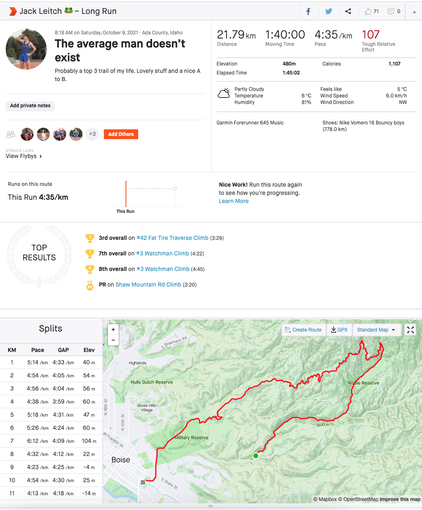
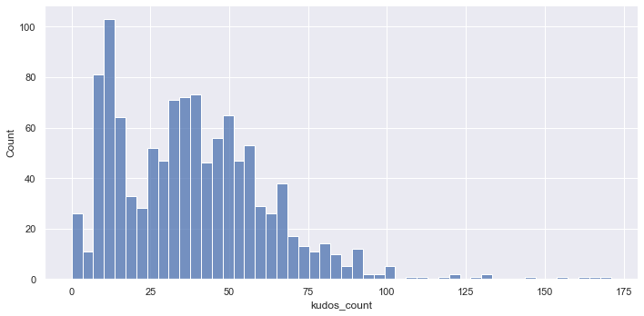
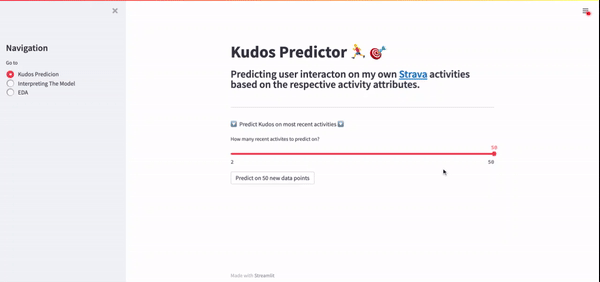
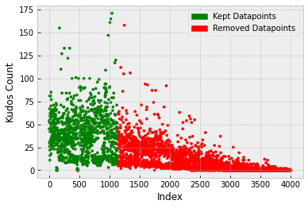
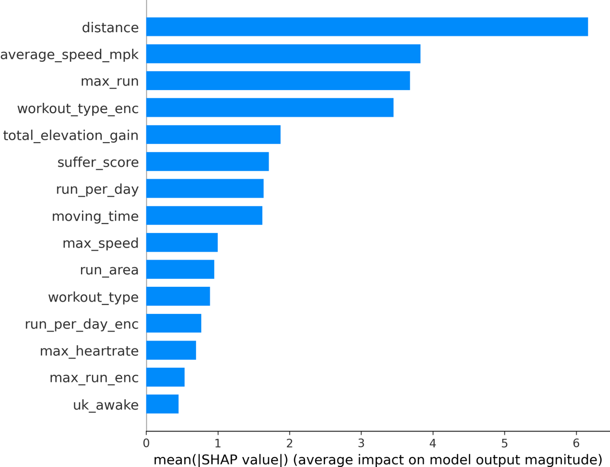
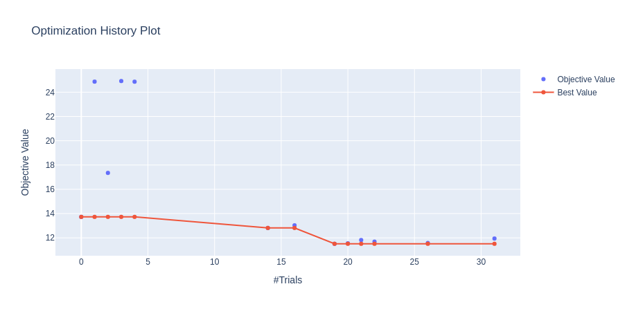
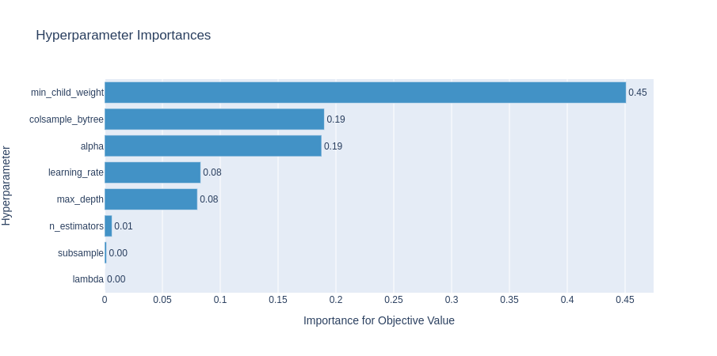
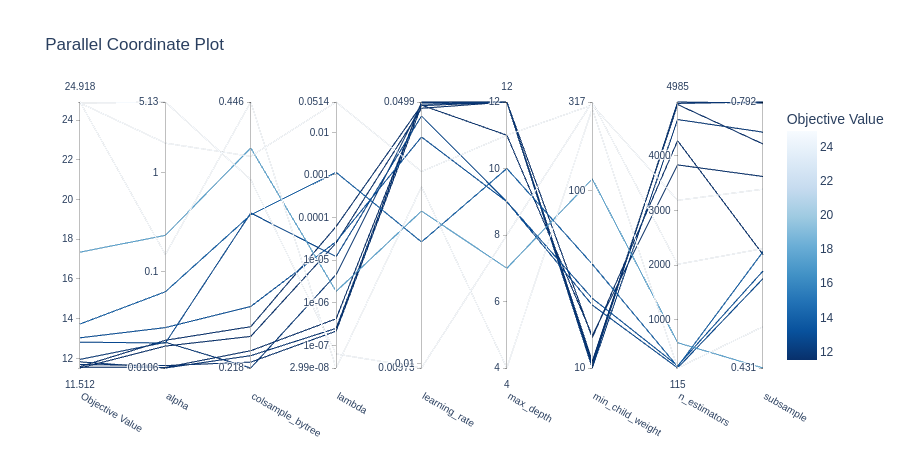
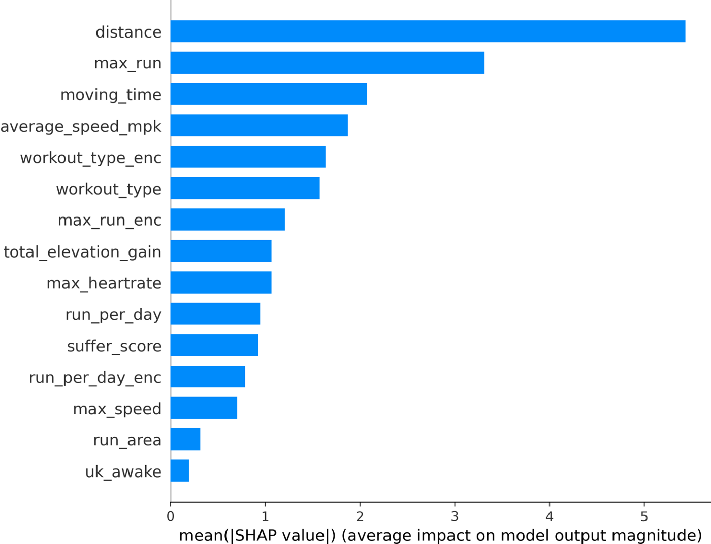
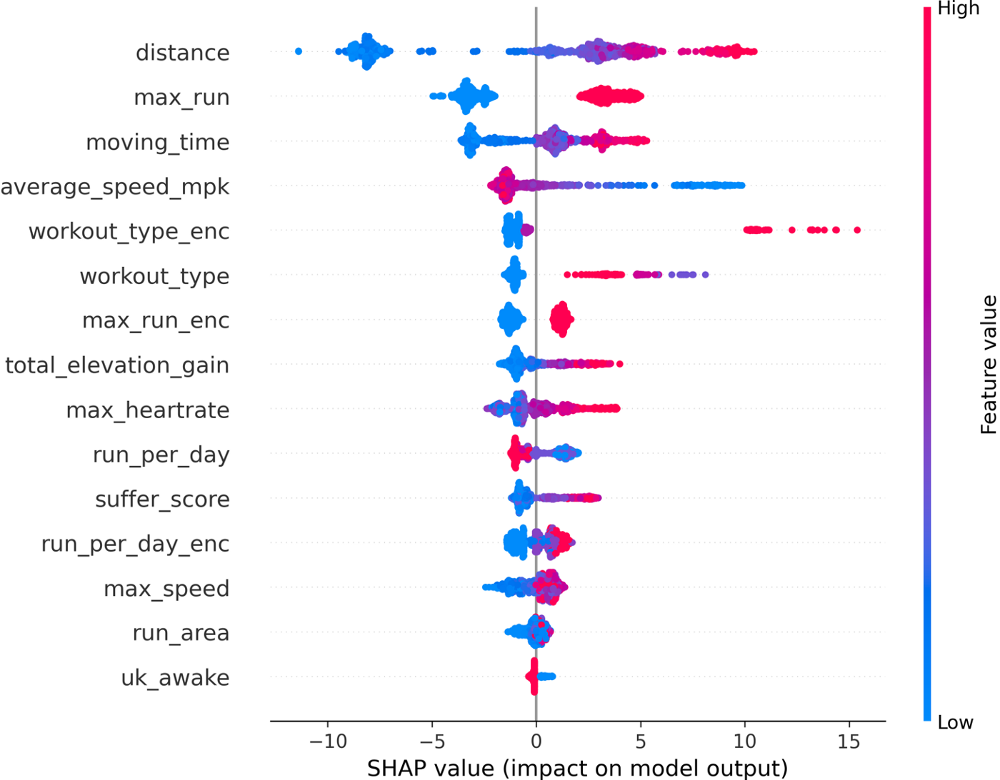

**An end-to-end data science project, from data collection to model deployment, aimed at predicting user interaction on Strava activities based on the given activity’s attributes.**

Strava is a service for tracking human exercise which incorporates social network type features. It is mostly used for cycling and running, with an emphasis on using GPS data. A typical Strava post from myself is shown below and we can see that it contains a lot of information: distance, moving time, pace, elevation, weather, GPS route, who I ran with, etc., etc.

<!--truncate-->



Now, Strava is also a social media and each activity can be given kudos, which is the equivalent of likes on other platforms. So given that I’ve posted over 4000 activities on Strava, it was a great place to start a unique little data science project. My goal was to predict the number of kudos each activity gets based on the activity's attributes.

Predicting Kudos wasn't necessarily an easy task, however. Of the data points extracted from Strava, the mean Kudos count was 38 with a standard deviation of 24. The minimum was 0 and the maximum was 171. There is a lot of variability in the data… so hopefully we can create some useful features to help explain this!



If you want to fast forward to the end project, you can find the finished product [here](http://strava-kudos.herokuapp.com/).

## Data Collection

Strava has a feature that allows the user to download all of their previous data, however, this can only be done once a week. A much better solution for data collection was to use the Strava API which allows you to make 100 requests every 15 minutes, and a total of 1000 daily i.e. more than enough calls for our intended goal.

Using this [API](https://developers.strava.com/docs/reference/), I was able to efficiently gather all my activity data very quickly. Lovely. Another benefit of this API was that it allowed me to extract my most recent activities so that I could predict kudos on the fly, which was one of the end goals for this project. A GIF of this real-time Kudos prediction on my Streamlit app can be seen below.



If you're interested in getting started with the Strava API, I would highly recommend that you start with [this blog post](https://medium.com/r?url=https%3A%2F%2Ftowardsdatascience.com%2Fusing-the-strava-api-and-pandas-to-explore-your-activity-data-d94901d9bfde).

Once I had set things up and had the required keys, getting recent activities was easy!

```py title="/src/strava_api.py"
def load_recent_data(recent=10):
    # get payload information
    auth_url = "https://www.strava.com/oauth/token"
    activites_url = "https://www.strava.com/api/v3/athlete/activities"
    payload = {
        "client_id": "XXXX",
        "client_secret": "XXXX",
        "refresh_token": "XXXX",
        "grant_type": "refresh_token",
        "f": "json",
    }
    # check if there is a new request token
    res = requests.post(auth_url, data=payload, verify=False)
    access_token = res.json()["access_token"]
    header = {"Authorization": "Bearer " + access_token}

    # initialise dataframe with first few activities
    param = {"per_page": recent, "page": 1}
    my_dataset = requests.get(activites_url, headers=header, params=param).json()
    activities = pd.json_normalize(my_dataset)
    # keep useful features
    columns_to_keep = ["name", "kudos_count", "distance", "moving_time", ...]
    activities = activities[columns_to_keep]
    return activities
```

By simply adding a while loop to this code, it was easy to get all the Strava data I needed for my project!

| name                             | distance           | moving_time       | total_elevation_gain | workout_type | kudos_count | max_speed | average_heartrate | max_heartrate | pr_count | suffer_score | is_named | local_date | run_per_day | max_run | run_area           | average_speed_mpk | datetime            | hour | uk_awake |
| -------------------------------- | ------------------ | ----------------- | -------------------- | ------------ | ----------- | --------- | ----------------- | ------------- | -------- | ------------ | -------- | ---------- | ----------- | ------- | ------------------ | ----------------- | ------------------- | ---- | -------- |
| Plastic bag floating in the wind | 16.1041            | 75.0              | 181.2                | 0.0          | 45          | 5.4       | 144.0             | 165.0         | 0        | 33.0         | 1        | 2021-09-09 | 1           | 1       | 12.377207167446613 | 4.656607991058955 | 2021-09-09 13:57:28 | 13   | 1        |
| Cake loop 🎂                     | 21.0416            | 99.05             | 346.9                | 0.0          | 54          | 5.0       | 151.0             | 167.0         | 1        | 83.0         | 1        | 2021-09-08 | 1           | 1       | 84.87930754199624  | 4.706580062129342 | 2021-09-08 13:43:26 | 13   | 1        |
| Doublé                           | 8.0736             | 38.78333333333333 | 92.0                 | 0.0          | 30          | 4.4       | 137.7             | 161.0         | 0        | 12.0         | 1        | 2021-09-07 | 2           | 0       | 4.8462999984622    | 4.802881844380403 | 2021-09-07 20:07:54 | 20   | 0        |
| Moderate beanage🐘               | 19.607200000000002 | 87.51666666666667 | 23.0                 | 3.0          | 52          | 7.3       | 142.9             | 191.0         | 0        | 44.0         | 1        | 2021-09-07 | 2           | 1       | 6.491399835795164  | 4.463310123192287 | 2021-09-07 13:12:26 | 13   | 1        |

## Exploratory Data Analysis (EDA)

Once I had all the data, the next thing on the agenda was some EDA. This involved exploring the data, looking at distributions, correlations, and general information about different features. The notebook I created for this can be found on [my Github page](https://github.com/jackmleitch/StravaKudos).

Some notable findings include:

- The Kudos received depends heavily on how many followers I had at the time. Unfortunately, there was no way to see how many followers I had at each point in time so I was unable to weight the Kudos with respect to follower count. I therefore could only use my most recent 1125 activities (from Dec 2019 to present) to train my model as the kudos stayed fairly consistent in this interval.



- It was found that the target variable (Kudos) is skewed right (also bimodal) and there are some extreme values above ~100. When using certain models, for example, linear regression, would like to see more of a normal distribution in the target variable. A BoxCox transform could therefore be used to see a more ‘normal-looking’ distribution in the target variable (normality can then be checked by plotting a q-q plot, for example).

- An [isolation forest model](https://scikit-learn.org/stable/modules/generated/sklearn.ensemble.IsolationForest.html) was used to detect outliers and out of the 800 training points, 17 outliers were found. Upon further investigation, these were predominantly activity uploads that were initially set to private but then switched to public at a later date. This meant that other users couldn't see or interact with the activity. These were removed from the training set.

- Features such as distance, moving_time, and average_speed_mpk seem to share a similar distribution to the one we have with kudos_count. This was confirmed when looking at a correlation matrix.

- The photo count feature only has a few different data points in each nonzero category so we can change this to a binary feature of contains photos/no photos.

- Workout type seems to correlate strongly with Kudos, however, there aren't that many data points for workout type 1 (a race). Intuitively, I also believe that races receive more Kudos in general. [SMOTE](https://imbalanced-learn.org/stable/references/generated/imblearn.over_sampling.SMOTE.html) was therefore used to oversample this workout type to give more predictive power to this feature and it was later found that this reduced the RMSE.

- By looking at time distribution between activities, it was found that runs that are quickly followed in succession by other runs tend to receive less kudos than runs that were the only activity that day. To add to this, the longest activity of the day tends to receive more kudos than the other runs that day.

## Preprocessing

### Train, Test, and Cross-Validation

I first needed to split my dataset into a train and test set. I used an 80/20 split and as my data contained dates, I just used the most recent 20% of data as the test set. I did not want to randomly shuffle the dataset as I created some time-based features.

It is extremely important to have a good cross-validation scheme in which validation data is representative of training and real-world data, as it makes the model you build highly generalizable. Now, because I only had a small number of training examples, it would be prohibitive to have both validation and test sets. Cross-validation was therefore used on the training set to simulate a validation set.

I split the training set into 5 folds using Sklearn’s [StratifiedKFold](https://scikit-learn.org/stable/modules/generated/sklearn.model_selection.StratifiedKFold.html), where [Sturge’s rule](https://www.statology.org/sturges-rule/) was used to calculate the appropriate number of bins.

```py title="/src/create_folds.py"
def create_folds(data):
    # create a new col kfold and fill with -1
    data["kfold"] = -1
    # randomize the rows of the data
    data = data.sample(frac=1).reset_index(drop=True)
    # Sturge's rule to calc bins
    num_bins = int(np.floor(1 + np.log2(len(data))))
    # bin targets
    data.loc[:, "bins"] = pd.cut(data["kudos_count"], bins=num_bins, labels=False)
    # initiate kfold class
    kf = model_selection.StratifiedKFold(n_splits=5)
    # fill the new kfold col
    for f, (t_, v_) in enumerate(kf.split(X=data, y=data.bins.values)):
        data.loc[v_, "kfold"] = f
    # drop bins col
    data = data.drop("bins", axis=1)
    # return df with folds
    return data
```

Using this cross-validation scheme I was able to confidently compare different models to select the most promising models without worrying about overfitting the validation sets. This scheme was also used to tune the hyperparameters of the promising models (the folds were reshuffled before hyperparameter tuning though). It is worth noting that the only time the model was evaluated on the test set was right at the end of the project when I wanted to get a real gauge of the true performance.

### Missing Values

There was not a huge amount of missing values in the dataset, and most of the missing values came from features that are fairly new to Strava/features I didn't always use. For example, the workout_type feature didn't always have a ‘race’ option (which turned out to have a lot of predicting power!). Before imputing missing values, it's always really important to first investigate missing values and try to find out if there is a reason why they are missing, it might be important!

After some inspection, I manually entered some missing values for workout_type as I believed this to be very important and some older data didn’t have labels. I chose to manually enter the values as any simple imputation technique would've assigned all the missing values to the default Strava category of ‘easy run’. A KNN imputer was also considered but there weren't many unlabeled data points so manual entry was quicker.

A heuristic function was also used to fill in activities with titles that contain race positions e.g. 10th or 1st, as these activities were obviously races. This was done because races seemed to always have a big influence on Kudos.

The general imputation scheme used on the whole dataset was:

- Any missing values in a categorical feature were just assigned a new category ‘NONE’ — this seems to work well most of the time when dealing with missing categories.

- All missing values in numeric features were imputed using the median strategy (mean was also tried but median worked better).

### Other Preprocessing

Other data preparation steps included: dropping activities that weren't runs, dropping activities that had no Kudos (mostly because run would've been on private and then switched to public), and formatting DateTime information.

## Feature Engineering

Feature engineering is one of the most crucial parts of building a good machine learning model. If we have useful features, the model will perform better.

### Time-Based Features

We have date and time data for each activity so we can easily make some trivial time-based features. Some of these features include year, week of the year, month, day of the week, time of day, weekend, etc.

From experience, I also know that the more activities I post on Strava a day the fewer kudos I tend to receive so I can try to incorporate this into a few features too. The features I made to encapsulate this:

- max_run (binary) — is the activity the longest in distance of that day?
- run_per_day (ordinal) — how many total activities were done that day.

I am from the U.K. but I am currently studying in Boise, Idaho so the majority of my friends/followers are from the U.K. To try to account for this, I made a binary feature ‘is_uk_awake’ that checks if the U.K. is awake when that activity was uploaded. I generally find that posting an activity outside of this time window results in fewer kudos.

### Other Features

- Runs that are left with default names such as ‘Afternoon Run’ tend to get less interaction than runs that have custom names. A binary feature was thus created to check if the run was named or not.

- I’ve always had an intuition that runs with really nice aesthetic GPS traces tend to receive more attention than runs that don't. To try to encapsulate this into a feature I used the runs GPS trace to workout the area enclosed by the run loop (an out and back run will return a value of 0). My idea is that bigger loops get more Kudos than smaller loops or out and back runs.

- Some other features were added and can be found in my code on Github.

### Feature Encoding

One-hot-encoding was used to encode categorical features and ordinal encoding was used to encode ordinal features (categorical features where the order means something).

The workout-type feature seemed to struggle with predictive power even though I know it is a very helpful and correlated feature, it might have something to do with the uneven distribution of categories. So to help it out I used target encodings. We need to be very careful here though as this might overfit the model. Target encoding is a technique in which you map each category in a given feature to its mean target value, but this needs to always be done in a cross-validated manner!

```py title="/src/target_encoding.py"
def mean_target_encoding(df):
    # list categorical columns
    cat_cols = ["workout_type", "is_named", ...]

    # we label encode all the features
    for col in cat_cols:
        # initialise label encoder
        lbl = preprocessing.LabelEncoder()
        # fit label encoder
        lbl.fit(df[col])
        # transform all of the data
        df.loc[:, col] = lbl.transform(df[col])

    # a list to store 5 validation dataframes
    encoded_dfs = []
    # loop over every fold
    for fold in range(3):
        # get training and validation data
        df_train = df[df.kfold != fold].reset_index(drop=True)
        df_valid = df[df.kfold == fold].reset_index(drop=True)
        # for all cat columns
        for column in cat_cols:
            # create dict of category:mean target
            mapping_dict = dict(df_train.groupby(column)["kudos_count"].mean())
            # column_enc is the new column we have with mean encodings
            df_valid.loc[:, column + "_enc"] = df_valid[column].map(mapping_dict)
        # append to our list of encoded validation dfs
        encoded_dfs.append(df_valid)

    # create full dataframe again and return
    encoded_df = pd.concat(encoded_dfs, axis=0)
    return encoded_df
```

### Feature Scaling

Finally, we need to consider scaling. As a rule of thumb, when we use a model that computes distance like K.N.N or assumes normality like linear regression, we need to scale our numeric features. Typically, we use either [min-max scaling](https://scikit-learn.org/stable/modules/generated/sklearn.preprocessing.MinMaxScaler.html) or [standardization](https://scikit-learn.org/stable/modules/generated/sklearn.preprocessing.StandardScaler.html) and to figure out which to use we just have to try both and see which results in the best performance. Tree-based models, however, are not distance-based and can handle varying ranges of features, and hence scaling is not required.

## Modeling

### Initial Model Selection

In this step, I built a few different candidate models and compared different metrics to determine which was the best model for deployment. Model performances and features used were saved in a CSV file to help keep track of which model was performing the best. It is very important when comparing models to train and evaluate in a cross-validated manner!

The training script I used is shown below (note: some things were removed to declutter, e.g. target encodings, etc.).

```py title="/src/train.py"
def run(fold, model, scale_features=False):

    # read training data with folds
    df = pd.read_csv(config.STRAVA_TRAIN_KFOLD_PATH)

    # list all features
    num_cols = ["distance", "average_speed_mpk", "suffer_score", ...]
    cat_cols = ["max_run", "workout_type", ...]
    # all cols are features except for target and kfold
    features = num_cols + cat_cols

    # fill cat column NaN values with NONE
    for col in cat_cols:
        df.loc[:, col] = df[col].astype(str).fillna("NONE")

    # training data is where kfold is not equal to fold
    df_train = df[df.kfold != fold].reset_index(drop=True)
    y_train = df_train.kudos_count.values

    # validation data is where kfold = fold
    df_valid = df[df.kfold == fold].reset_index(drop=True)
    y_valid = df_valid.kudos_count.values

    # pipelines for model transformation
    if scale_features:
        num_pipeline = Pipeline(
            [
                ("imputer", impute.SimpleImputer(strategy="median")),
                ("std_scaler", preprocessing.StandardScaler()),
            ]
        )
    else:
        num_pipeline = Pipeline([("imputer", impute.SimpleImputer(strategy="median"))])

    cat_pipeline = Pipeline(
        [("cat", preprocessing.OneHotEncoder(handle_unknown="ignore"))]
    )

    # transforms columns and drops columns not specified
    x_train_num = num_pipeline.fit_transform(df_train[num_cols])
    x_train_cat = cat_pipeline.fit_transform(df_train[cat_cols])
    x_valid_num = num_pipeline.transform(df_valid[num_cols])
    x_valid_cat = cat_pipeline.transform(df_valid[cat_cols])

    # join numeric data and categorical data
    x_train = hstack((x_train_num, x_train_cat), format="csr")
    x_valid = hstack((x_valid_num, x_valid_cat), format="csr")

    # initialize model
    model = model_dispatcher.models[model]

    # fit model on training data
    model.fit(x_train, y_train)

    # predict on validation data
    valid_preds = model.predict(x_valid)

    # get rmse, and mape
    rmse = metrics.mean_squared_error(y_valid, valid_preds, squared=False)
    max_error = metrics.max_error(y_valid, valid_preds)
    print(f"Fold = {fold}, rmse = {rmse}, max error = {max_error}")

    data = [x_train, y_train, x_valid, y_valid]

    return rmse, model, data
```

Some shortlisted models that performed well were: [XGBoost](https://xgboost.readthedocs.io/en/latest/python/python_api.html), [Lasso](https://scikit-learn.org/stable/modules/generated/sklearn.linear_model.Lasso.html), and [Random Forest](https://scikit-learn.org/stable/modules/generated/sklearn.ensemble.RandomForestRegressor.html). These models were then taken forward to the feature selection stage.

### Feature Selection

Feature selection was then performed to help reduce the dimensionality of the dataset with the hope that this creates a more generalizable model, we've all heard of the [curse of dimensionality](https://towardsdatascience.com/the-curse-of-dimensionality-50dc6e49aa1e).

Different feature selection techniques were used for the different models. For example, we did not need to do much selection for the Lasso model. When trying to minimize the cost function, Lasso regression will automatically select those features that are useful, discarding the useless or redundant features. Therefore, all we needed to do was remove features with coefficients equal to zero.

With the tree-based models, the final methodology used a combination of [Shapley values](https://towardsdatascience.com/a-novel-approach-to-feature-importance-shapley-additive-explanations-d18af30fc21b) and the built-in feature importance values. Although, care needs to be taken when looking at the feature importance from tree-based models which you can read more about it [here](https://towardsdatascience.com/be-careful-when-interpreting-your-features-importance-in-xgboost-6e16132588e7).

PCA was also trialed to help combat the dimensionality but it did not improve the model performance or generalizability. One reason might be that the feature space was only reduced by 2 when accounting for 90% of the variance.

The final features chosen were: distance, average speed, max run (was the run the longest run of the day), workout type (+target encodings), total elevation gain, moving time, suffer score, run per day (number of runs that day), max speed, run area (area enclosed by GPS trace), and UK awake (was the UK awake when activity was posted?).



### Hyperparameter Tuning

[Optuna](https://optuna.org/) was used to tune all three shortlisted models, an open-source framework that is very easy to use and incredibly good. In particular, the Tree-structured Parzen Estimator (TPE) was used to sample the parameter space, which uses Bayesian reasoning to construct a surrogate model and can select the next hyperparameters using [Expected Improvement](<http://krasserm.github.io/2018/03/21/bayesian-optimization/#:~:text=Expected%20improvement%20is%20defined%20as,if%20σ(x)%3D0>). A good tutorial on hyperparameter tuning with Optuna can be found [here](https://medium.com/subex-ai-labs/efficient-hyperparameter-optimization-for-xgboost-model-using-optuna-3ee9a02566b1).

The code I used to tune my XGB model is shown below.

```py title="/src/tune_hyperparameters/py"
def objective(trial, n_jobs=-1, random_state=42):
    # read in the data
    data = pd.read_csv("input/data_train.csv")
    # prepare data
    df = process(data)
    df.loc[:, "kudos_count"] = data.kudos_count

    # stratisfied kfold
    df = create_folds(df)

    # define parameter search space for XGB
    params = {
        "tree_method": "gpu_hist",
        "verbosity": 0,  # 0 (silent) - 3 (debug)
        "objective": "reg:squarederror",
        "n_estimators": trial.suggest_int("n_estimators", 100, 5000),
        "max_depth": trial.suggest_int("max_depth", 4, 12),
        "learning_rate": trial.suggest_loguniform("learning_rate", 0.005, 0.05),
        "colsample_bytree": trial.suggest_loguniform("colsample_bytree", 0.2, 0.6),
        "subsample": trial.suggest_loguniform("subsample", 0.4, 0.8),
        "alpha": trial.suggest_loguniform("alpha", 0.01, 10.0),
        "lambda": trial.suggest_loguniform("lambda", 1e-8, 10.0),
        "gamma": trial.suggest_loguniform("lambda", 1e-8, 10.0),
        "min_child_weight": trial.suggest_loguniform("min_child_weight", 10, 1000),
        "seed": random_state,
        "n_jobs": n_jobs,
    }

    # add pruning callback which prunes unpromising trials
    pruning_callback = XGBoostPruningCallback(trial, "validation_0-rmse")

    # scores for each fold
    scores = []
    # everything is a feature apart from the target and kfold col
    features = [f for f in df.columns if f not in ("kudos_count", "kfold")]
    # loop over each fold
    for fold in range(5):
        # training data is where kfold is not equal to fold
        x_train = df[df.kfold != fold].reset_index(drop=True)
        y_train = x_train.kudos_count.values
        x_train = x_train[features]
        # validation data is where kfold = fold
        x_valid = df[df.kfold == fold].reset_index(drop=True)
        y_valid = x_valid.kudos_count.values
        x_valid = x_valid[features]
        # initialize model and fit on data
        model = xgb.XGBRegressor(**params)
        model.fit(
            x_train,
            y_train,
            eval_set=[(x_valid, y_valid)],
            early_stopping_rounds=100,
            verbose=False,
            callbacks=[pruning_callback],
        )
        # predict and score model on validation set
        preds = model.predict(x_valid)
        scores.append(mean_squared_error(y_valid, preds, squared=False))

    # return average rmse across the 5 folds
    score = sum(scores) / len(scores)
    return score


if __name__ == "__main__":
    # initialize Optuna TPE sampler
    sampler = TPESampler()
    # create study in which we minimize rmse
    study = create_study(direction="minimize", sampler=sampler)
    # optimize hyperparams on XGB model
    study.optimize(objective, n_trials=100)

    # display params
    best = study.best_params
    for key, value in best.items():
        print(f"{key:>20s} : {value}")
    print(f"{'best objective value':>20s} : {study.best_value}")

    # save best hyperparams
    with open("models/production/xgb_params.pickle", "wb") as f:
        pickle.dump(best, f)
```

The optimization history plot below shows how quickly the TPE sampler converges to the optimal hyperparameters. The two other plots show the importance of each hyperparameter and the high-dimensional parameter relationships, respectively.





### Model Selection

After performing the hyperparameter tuning, it was found that the XGB model consistently outperformed the other two shortlisted models. As seen in the table below, the average RMSE over 5 folds was lower. It was also found that the variance of the error was lower. From this, I concluded that with the data I had, the XGB model was more likely to generalize better to unseen data.

| Model                 | Fold 1 | Fold 2 | Fold 3 | Fold 4 | Fold 5 | Mean  | Variance |
| --------------------- | ------ | ------ | ------ | ------ | ------ | ----- | -------- |
| XGBRegressor          | 9.12   | 9.47   | 9.33   | 9.59   | 9.54   | 9.41  | 0.036    |
| RandomForestRegressor | 10.51  | 10.94  | 11.09  | 11.16  | 10.75  | 10.89 | 0.070    |
| Lasso                 | 9.78   | 9.99   | 10.93  | 11.04  | 10.96  | 10.54 | 0.36     |

The final XGB model was then trained on the **whole** training dataset using the hyperparameters found earlier.

It was comforting to see that when these three models were used to predict on the test dataset, the XGB model outperformed both other models. Disclaimer: this was (and needs to be) done after model selection, you don't want to overfit the test set! The test set scores were 9.78, 11.83, and 10.68 for XGB, RF, and Lasso, respectively.

## Deployment

The model, along with some other features, was deployed using Streamlit and Heroku. Tutorials on Streamlit and Heroku can be found [here](https://towardsdatascience.com/build-your-first-interactive-data-science-web-app-with-streamlit-d4892cbe4792) and [here](https://towardsdatascience.com/a-quick-tutorial-on-how-to-deploy-your-streamlit-app-to-heroku-874e1250dadd). An interface was built in which you could predict on my real-time Strava data, explore the model explainability, and explore the dataset. The app can be found [here](http://strava-kudos.herokuapp.com/) (it may take a minute or so to boot up, apologies).

## Model Explainability

The final part of this project was investigating the model to try and see, in general, what attributes caused activities to get more/fewer kudos.

Interpreting XGBoost models is a notoriously hard task but with the combination of a solid theoretical backing and a fast practical algorithm, SHAP values are an incredibly powerful tool for confidently interpreting tree-based models.

The mean SHAP values for the final features can be seen below.


We can see that the distance feature is actually the most important, followed by the max_run feature (which is great to see as this is a feature I created!). Because SHAP gives us individualized explanations for every activity, we can do more than just make a bar chart. We can see how each feature affects the final Kudos value:


The color in this plot represents the feature value — red indicating high and blue indicating low. So we can see that longer faster runs get more Kudos. More effort (higher heart rate and suffer score) also results in higher Kudos. On the other hand, easy runs get fewer Kudos than workouts, long runs, and races.

## Closing Thoughts

So there we go, a unique and successful data science project has been finished. Well, kind of… just because we have built a good model doesn't mean the model is always going to be a good one, it might drift.

Model drift refers to the degradation of model performance due to changes in data and relationships between input and output variables. So its important to check in every and then to see if the model is still performing at an adequate level. Maybe this is a topic for a future blog though.

Thanks for reading and I hope you enjoyed it. If you have any comments or questions please feel free to reach out.
