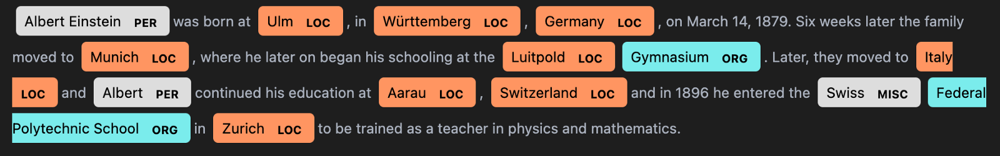
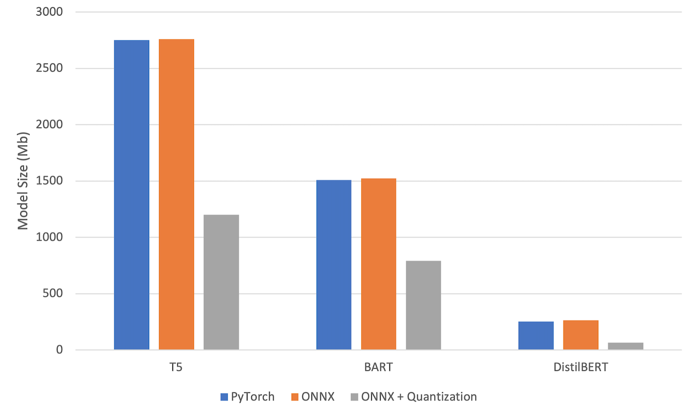
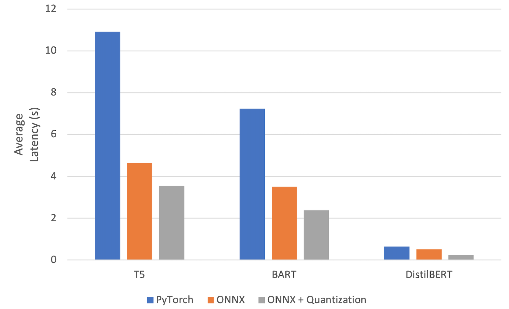
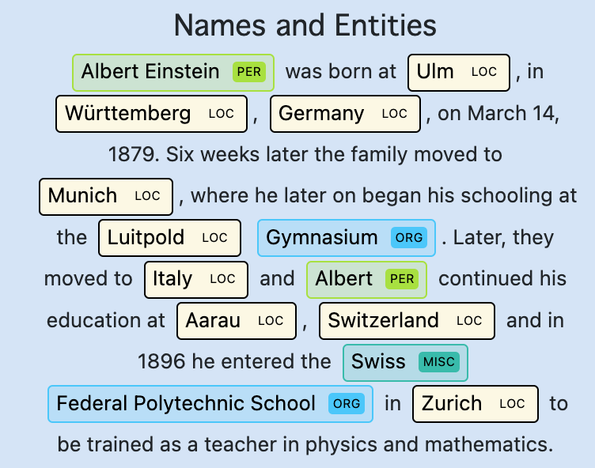
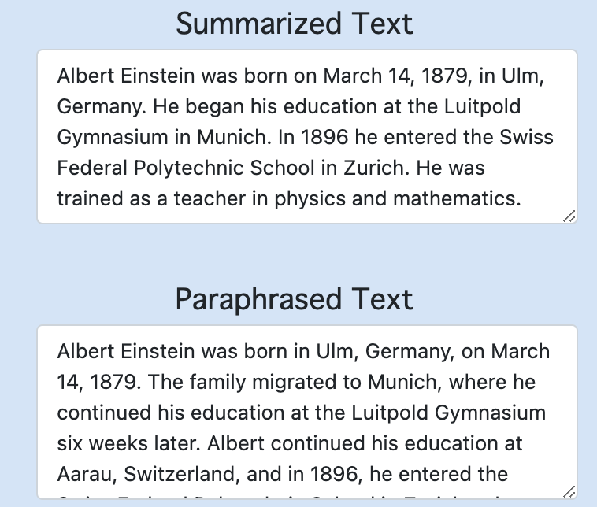
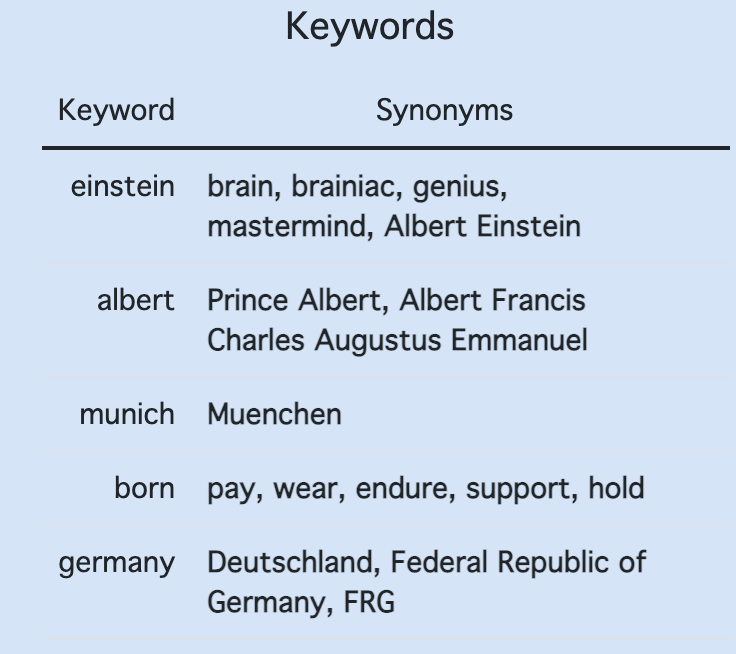

**... and deploying on Google Chrome with FastAPI and Docker**

I recently finished the fantastic new Natural Language Processing with Transformers book written by a few guys on the Hugging Face team and was inspired to put some of my newfound knowledge to use with a little NLP-based project. While searching for some ideas I came across an [excellent blog post](https://medium.com/data-science-at-microsoft/developing-microsoft-edge-extensions-powered-by-sota-nlp-models-f3991f18daa4) by Tezan Sahu in which he built a Microsoft Edge extension to paraphrase text highlighted on your screen. I wanted to take this a step further by:

1. optimizing model inference with **ONNX runtime** and **quantization**,

2. include features such as summarization, name entity recognition (NER), and keyword extraction.
<!--truncate-->


The idea is that this creates the ultimate essay companion as it can help quickly understand text with the summaries and NER, and it can get those creative juices flowing with the paraphrased text and keyword synonyms. Obviously, I would hope people use it to rewrite their own work and not other peoples…

:::info

**TL;DR:** [This repository](https://github.com/jackmleitch/EssayCompanion) contains all the code mentioned in this article. ML stuff can be found in the [src](https://github.com/jackmleitch/EssayCompanion/tree/main/src) folder and Chrome extension stuff is in the [extension](https://github.com/jackmleitch/EssayCompanion/tree/main/extension) folder.

:::

## Models

There are four different models (and tokenizers) in action in this extension, three of which were found on Hugging Face!

### [T5 Paraphrasing Model](https://huggingface.co/ramsrigouthamg/t5-large-paraphraser-diverse-high-quality)

This was the largest model used, coming in at 2.75Gb (!), and was fine-tuned for paraphrasing by Ramsri Goutham. **T5** is an encoder-decoder model pre-trained on a multi-task mixture of unsupervised and supervised tasks and for which each task is converted into a text-to-text format.

The text is first split into sentences using **NLTK**'s sentence tokenizer sent_tokenize. Each sentence was then passed through the T5 model and the paraphrased output for each sentence was joined to get a new paraphrased paragraph.

```py title="/src/paraphrase/paraphrasing_model.py"
class ParaphraseModel:
    """Provides utility to load HuggingFace paraphrasing model and generate paraphrased text."""

    def __init__(self, model_ckpt: str="ramsrigouthamg/t5-large-paraphraser-diverse-high-quality",
        num_beams: int=5) -> None:
        """
        :param model_ckpt: path to HuggingFace model checkpoint, default is the T5 paraphraser
        :param num_beams: number of beams to perform beam search when generating new text
        """
        self.num_beams = num_beams
        self.model_ckpt = model_ckpt
        self.torch_device = "cuda" if torch.cuda.is_available() else "cpu"
        self.tokenizer = AutoTokenizer.from_pretrained(model_ckpt)
        self.model = AutoModelForSeq2SeqLM.from_pretrained(model_ckpt)

    def paraphrase_text_model(self, input_text: str) -> str:
        """
        Tokenize sentences and then pass to model to paraphrase text.
        :param input_text: input text to feed to model
        :return: paraphrased text
        """
        sentences = sent_tokenize(input_text)
        batch = (self.tokenizer(sentences, truncation=True, padding="longest",
            max_length=100, return_tensors="pt").to(self.torch_device))
        translated = self.model.generate(**batch, max_length=100, num_beams=self.num_beams,
            num_return_sequences=1, temperature=1.5)
        paraphrased_text = self.tokenizer.batch_decode(translated, skip_special_tokens=True)
        if self.model_ckpt == "ramsrigouthamg/t5-large-paraphraser-diverse-high-quality":
            # remove 'paraphrasedoutput: ' from result
            paraphrased_text = [sentence[19:] for sentence in paraphrased_text]
        paraphrased_text = " ".join(paraphrased_text)
        return paraphrased_text
```

Some example output:

_The ultimate test of your knowledge is your capacity to convey it to another **=>** Your ability to pass it from one to another is the ultimate measure of your intelligence._

That's pretty good, we can see our paraphrased text is coherent and has a different structure from the original text!

### [BART Summarization Model](https://huggingface.co/facebook/bart-large-cnn)

**BART** is also an encoder-decoder (seq2seq) model with a bidirectional (like BERT) encoder and an autoregressive (like GPT) decoder. BART is pre-trained by (1) corrupting text with an arbitrary noising function, and (2) learning a model to reconstruct the original text.

As an example, a recent 250-word long [news article](https://www.eurogamer.net/portable-electronic-devices-sold-in-the-eu-will-require-usb-c-charging-by-autumn-2024) regarding USB-C rule enforcements in the EU is summarized in 55 words:

_By autumn 2024, all portable electronic devices sold in the EU will need to use USB Type-C for charging. The aim is to reduce electronic waste and be more consumer-friendly by having just one "common charger". The biggest impact will be Apple's iPhones and iPads, which will no longer be able to use lightning cables._

Wow! It's worked superbly and picks out all the key points made in the article concisely.

### [DistilBERT NER Model](https://huggingface.co/elastic/distilbert-base-uncased-finetuned-conll03-english)

A **DistilBERT** base uncased model fine-tuned for **NER** using the conll03 English dataset was used. DistilBERT is a smaller and faster model than **BERT**, which was pre-trained on the same corpus in a self-supervised fashion, using the BERT base model as a teacher. The NER model is simply a DistilBERT encoder with a token classification head added to the end to predict each entity: person, location, organization, and misc.

```py title="/src/ner/ner_model.py"
class NERModel:
    """Load name entity recognition model and build prediction pipeline"""

    def __init__(self,
        model_ckpt: str="elastic/distilbert-base-uncased-finetuned-conll03-english") -> None:
        self.model_ckpt = model_ckpt
        self.tokenizer = AutoTokenizer.from_pretrained(model_ckpt)
        self.model = AutoModelForTokenClassification.from_pretrained(model_ckpt)
        # id to label mapping to convert predictions back to entities
        self.id2label = self.model.config.id2label

    def ner_pipeline(self, query: str) -> List[dict]:
        """
        Build ner pipeline and return parsed model output
        :param query: query to pass to the model
        """
        pipe = pipeline(model=self.model_ckpt, tokenizer=self.tokenizer, task='ner',
            aggregation_strategy="simple")
        return pipe(query)
```

In the chrome extension, the NER results were rendered in HTML using **SpaCy**. Some example output is below.



### [KeyBERT Keyword Extraction Model](https://maartengr.github.io/KeyBERT/)

This model leverages BERT text embeddings and cosine similarity to find the sub-phrases in a document that are the most similar to the document itself. The idea is that these sub-phrases are the most important phrases in the text.

Keywords are first extracted from the text using the **KeyBERT** model. Once the keywords are found, **WordNet** is used to find synonyms for each keyword. It's worth noting that in WordNet, similar words are grouped into a set known as a Synset and the words in a Synset are lemmatized.

```py title="/src/keyword/keybert_model.py"
class GetKeywords():
    """Extract keywords and find synonyms for them"""

    def __init__(self) -> None:
        self.model = KeyBERT()

    def get_keywords(self, query: str) -> List[str]:
        """Get keywords from query text using KeyBERT"""
        keywords = self.model.extract_keywords(query)
        return [word[0] for word in keywords]

    def get_synonyms_for_keyword(self, keyword: str, max_synonyms: int=5) -> List[str]:
        """Find synonyms for a given word"""
        synonyms = []
        for synonym in wordnet.synsets(keyword):
            for lemma in synonym.lemmas():
                synonyms.append(lemma.name().replace("_", " "))
        return [synonym for synonym in list(set(synonyms))
                    if synonym.lower() != keyword.lower()][:max_synonyms]

    def get_synonyms_for_keywords(self, query: str, max_synonyms: int=5) -> Dict[str, List]:
        """Find synonyms for all keywords and return them"""
        keywords = self.get_keywords(query)
        keyword_synonyms = {}
        for keyword in keywords:
            synonyms = self.get_synonyms_for_keyword(keyword, max_synonyms)
            if len(synonyms) > 0:
                keyword_synonyms[keyword] = synonyms
        return keyword_synonyms
```

The keywords and associated synonyms found in the sentence 'The ultimate test of your **knowledge** is your capacity to **convey** it to another' are:

- Knowledge: comprehension, cognition, grasp
- Convey: transport, carry, deliver

## Model Optimization

The initial performance of the models was _OK_ when running inference on GPU but very poor when running on CPU. Even GPU inference wasn't as fast as I'd like since the decoder models have to sequentially decode the model output which cannot be parallelized. Memory was also an issue as I wanted to be able to use this extension on devices with limited memory and compute resources (I have my _ancient_ 2015 MacBook pro in mind…) and two of the models were over 1.5Gb in size! My goal was to reduce the memory footprint of these models as much as possible and optimize performance on CPU inference while maintaining model performance.

**Quantization** and **distillation** are two techniques commonly used to deal with size and performance challenges. Distillation was already used with the NER model as DistilBERT is a distilled version of the O.G. BERT model. In my case, distillation of T5/BART was out of the question due to my limited compute resources.

The first step I took was to convert the PyTorch models to ONNX, an open representation format for machine learning algorithms, this allows us to optimize inference for a targeted device (CPU in this case). The Hugging Face Transformer library includes a [tool](https://github.com/huggingface/transformers/blob/main/src/transformers/convert_graph_to_onnx.py) to easily convert models to ONNX and this was used to convert the DistilBERT model. Converting the encoder-decoder models was a little trickier as seq2seq conversions currently aren't supported by Hugging Face's ONNX converter. I was able to make use of [this](https://github.com/Ki6an/fastT5) fantastic GitHub repository, however, which converts the encoder and decoder separately and wraps the two converted models in the Hugging Face Seq2SeqLMOutput class.

After the models were converted to ONNX, QInt8 quantization was used to approximate floating-point numbers with lower bit width numbers, dramatically reducing the memory footprint of the model and accelerating performance as computations can be further optimized. Quantization can however introduce a loss in performance as we lose information in the transformation, but it has been extensively demonstrated (e.g. see [here](https://arxiv.org/pdf/2103.13630.pdf)) that weights can be represented in 8-bit integers without a significant drop in performance. It comes as no surprise that the quantization of ONNX models is super easy!

```py title="/src/ner/quantize_ner_model.py"
from onnxruntime.quantization import quantize_dynamic, QuantType

model_input = "models/ner/model/model.onnx"
model_output = "models/ner/model/model_quant.onnx"
quantize_dynamic(model_input, model_output, weight_type=QuantType.QInt8)
```

We can then optimize model inference for CPU usage!

```py title="/src/ner/onnx_ner_model.py"
from onnxruntime import InferenceSession, SessionOptions, GraphOptimizationLevel
from transformers import AutoTokenizer

def create_model_for_provider(model_path, provider='CPUExecutionProvider'):
    """
    Create CPU inference session for ONNX runtime to boost performance
    :param model_path: path to *.onnx model
    :param provider: CPU/CUDA
    :return: onnx runtime session
    """
    options = SessionOptions()
    options.intra_op_num_threads = 1
    options.graph_optimization_level = GraphOptimizationLevel.ORT_ENABLE_ALL
    session = InferenceSession(str(model_path), options, providers=[provider])
    session.disable_fallback()
    return session

class NEROnnxModel():
    """Build NER onnx model and aggregate results into data to be rendered"""
    def __init__(self) -> None:
        self.model_path = "models/ner/model/model_quant.onnx"
        self.model = create_model_for_provider(self.model_path)
        self.tokenizer = AutoTokenizer.from_pretrained("models/ner/tokenizer/")
        self.id2label = {0: "O", 1: "B-PER", 2: "I-PER", 3: "B-ORG",
            4: "I-ORG", 5: "B-LOC", 6: "I-LOC", 7: "B-MISC", 8: "I-MISC"}

    def __call__(self, sentence: str) -> str:
        # get model inputs and other required arrays
        model_inputs = self.tokenizer(sentence, return_tensors="np",
            return_special_tokens_mask=True, return_offsets_mapping=True)
        special_tokens_mask = model_inputs.pop("special_tokens_mask")[0]
        offset_mapping = model_inputs.pop("offset_mapping")[0]
        # pass to model
        logits = self.model.run(None, dict(model_inputs))[0]
        predictions = np.argmax(logits, axis=2)[0]
        input_ids = model_inputs["input_ids"][0]
        model_outputs = {"sentence": sentence, "input_ids": input_ids, "predictions": predictions,
            "offset_mapping": offset_mapping, "special_tokens_mask": special_tokens_mask}
        # aggregate entitity information
        pre_entities = self.gather_pre_entities(**model_outputs)
        entities = self.aggregate_words(pre_entities)
        entities = self.group_entities(entities)
        results = self.build_final_output(sentence, entities)
        return results

    ...
```

The results from the model optimizations are shown below. We can see that our efforts resulted in a **~2x reduction in size** and a **~3x latency boost**!

 

## Deploying a Model Endpoint with FastAPI + Docker

To deploy our application, I used two tools as the main building blocks: [FastAPI](https://fastapi.tiangolo.com) and [Docker](https://www.docker.com). FastAPI makes building a web framework around the models super easy and Docker is a containerization tool allowing us to easily package and run the application in any environment.

Using FastAPI we package the model and build an API to communicate with it. We also use Pydantic to validate user input and model output, we can never be too careful! For example, we ensure the input text is a string, the response from the summarization model is a string, and the keyword extraction model returns a dictionary containing a list of strings.

```py title="/src/main.py"
from fastapi import FastAPI
from pydantic import BaseModel
from starlette.middleware.cors import CORSMiddleware

paraphrasing_pipeline = ParaphraseOnnxPipeline(num_beams=8)
ner_pipeline = NEROnnxModel()
summarization_pipeline = SummarizeOnnxPipeline(num_beams=8)
keyword_pipeline = GetKeywords()

app = FastAPI()

# allow CORS requests from any host so that the JavaScript can communicate with the server
app.add_middleware(
    CORSMiddleware, allow_origins=["*"], allow_methods=["*"], allow_headers=["*"])

class Request(BaseModel):
    text: str

...

class KeywordResponse(BaseModel):
    response: Dict[str, List[str]]

class AllModelsResponse(BaseModel):
    original: str
    paraphrased: ParagraphResponse
    name_entities: NERResponse
    summarized: ParagraphResponse
    keyword_synonyms: KeywordResponse

@app.post("/predict", response_model=AllModelsResponse)
async def predict(request: Request):
    paraphrased_text = ParagraphResponse(text=paraphrasing_pipeline(request.text))
    ner_text = NERResponse(render_data=ner_pipeline(request.text))
    summarized_text = ParagraphResponse(text=summarization_pipeline(request.text))
    keyword_synonyms = KeywordResponse(response=keyword_pipeline.get_synonyms_for_keywords(request.text))
    return AllModelsResponse(
        original=request.text, paraphrased=paraphrased_text,
        name_entities=ner_text, summarized=summarized_text,
        keyword_synonyms=keyword_synonyms
    )
```

Docker is then used to containerize the API server, this allows us to run the application on any machine without worrying about the faff of reproducing my exact environment. To build a Docker image of the server, I created a Dockerfile in the root folder of the project.

```js title="Dockerfile"
FROM ubuntu:20.04

COPY ./src /api/api
COPY ./models /api/models
COPY requirements.txt /requirements.txt

RUN apt-get update \
    && apt-get install python3-dev python3-pip -y \
    && pip3 install -r requirements.txt

RUN python3 -m nltk.downloader punkt wordnet omw-1.4

ENV PYTHONPATH=/api
WORKDIR /api

EXPOSE 8000

ENTRYPOINT ["uvicorn"]
CMD ["api.main:app", "--host", "0.0.0.0"]
```

To host the extension online we could use either **Azure's Container Service** or **AWS' Elastic Container Service**. I haven't gotten around to this yet but plan on doing it at some point soon!

## Building The Google Chrome Extension 

The last piece of the puzzle was to build the chrome extension which consisted of 3 parts:

- `manifest.json` containing the configuration of the extension
- `popup.html` & style.css defining the user interface
- `popup.js` to communicate with the API and implement the actual functionality of the extension.

```js title="/extension/popup/popup.js"
// Issue a POST request with a request body
function doPost(url, body, callback) {
  var xmlHttp = new XMLHttpRequest();
  xmlHttp.onreadystatechange = function () {
    if (xmlHttp.readyState == 4 && xmlHttp.status == 200)
      callback(xmlHttp.responseText);
  };
  xmlHttp.open("POST", url, true);
  xmlHttp.setRequestHeader("Content-type", "application/json; charset=utf-8");
  xmlHttp.send(body);
}
```

I followed [this](https://medium.com/data-science-at-microsoft/developing-microsoft-edge-extensions-powered-by-sota-nlp-models-f3991f18daa4) fantastic tutorial to build the web extension so please check it out if you're looking to do something similar. The only thing I changed myself was changing the output to include more models and rendering the NER results in HTML. This is what the final product looks like for some example text found online!

|  |  |
| -------------------------------------------- | -------------------------------------------- |
|  |  |

## Concluding Remarks 

In this blog post, I've shown how you can leverage state-of-the-art transformer models to build 'smart' text-based applications. I started by finding suitable models for paraphrasing, summarization, name entity recognition, and keyword extraction before optimizing them for model inference on CPU. I then deployed the models at an API endpoint using FastAPI and containerized the application for reproducibility.

:::info
All the code for this project can be found in [this GitHub repository](https://github.com/jackmleitch/EssayCompanion).
:::

Feel free to reach out to me on [LinkedIn](https://www.linkedin.com/in/jackmleitch/)!
